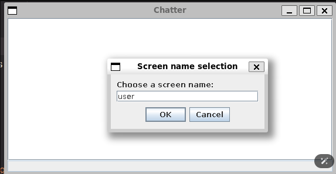
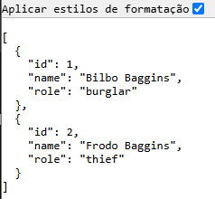
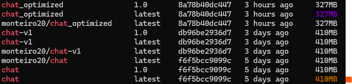
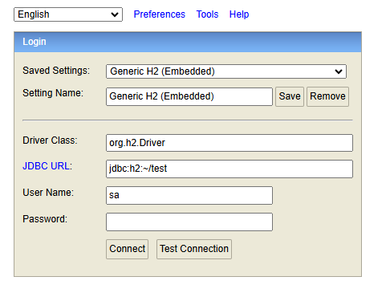
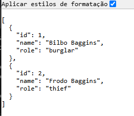

# CA5 - Containers

## Table of Contents
1. [Creating and Managing Docker Images](#creating-and-managing-docker-images)
   1. [Setting Up Docker](#setting-up-docker)
   2. [Packaging Applications into Docker Containers](#packaging-applications-into-docker-containers)
   3. [Creating Docker Images: Two Approaches](#creating-docker-images-two-approaches)
   4. [Understanding Docker Image Layers and Monitoring](#understanding-docker-image-layers-and-monitoring)
   5. [Publishing](#publishing)
   6. [Optimize the Dockerfiles](#optimize-the-dockerfiles)
2. [Containerized Environment with Docker Compose](#containerized-environment-with-docker-compose)
   1. [Overview of Docker Compose](#overview-of-docker-compose)
   2. [Setting Up Containers](#setting-up-containers)
   3. [Testing Container Networking and Health Checks](#testing-container-networking-and-health-checks)
   4. [Data Persistence with Docker Volumes](#data-persistence-with-docker-volumes)
   5. [Publishing](#publishing)
3. [Useful Docker and Docker Compose Commands](#useful-docker-and-docker-compose-commands)
4. [Docker Alternative](#docker-alternative)


## Creating and Managing Docker Images
In this section, we will explore the process of creating and managing Docker images for applications. Docker images are the building blocks of containers, providing a lightweight, portable, and consistent environment for running applications.

The following steps outline the implementation of the solution:
### Setting Up Docker

1. Update existing packages:
```
sudo apt update
sudo apt upgrade -y
```
2. Install required dependencies:
```
sudo apt install -y apt-transport-https ca-certificates curl software-properties-common
```
3. Add Docker’s GPG key:
```
curl -fsSL https://download.docker.com/linux/ubuntu/gpg | sudo gpg --dearmor -o /usr/share/keyrings/docker-archive-keyring.gpg
```
4. Install Docker:
```
sudo apt update
sudo apt install -y docker-ce docker-ce-cli containerd.io
```
5. Verify the installation:
```
docker --version
```


### Packaging Applications into Docker Containers
To dockerized the Chat Application and Spring REST API, we need to create Docker images for each application. The Docker images will contain the necessary dependencies, configurations, and application code to run the applications in containers.

#### Chat Application Dockerfile
Inside the CA2 folder, where the chat application code is located, create a Dockerfile with the following content:
```Dockerfile
# Use an official OpenJDK runtime as the base image
FROM openjdk:17-jdk-slim

# Set the working directory in the container
WORKDIR /app

# Copy the jar file (assuming you have built the app into a jar using Gradle)
COPY build/libs/basic_demo-0.1.0.jar /app/basic_demo-0.1.0.jar

# Set the command to run the chat server
CMD ["java", "-cp", "/app/basic_demo-0.1.0.jar", "basic_demo.ChatServerApp", "59001"]
```
This file defines the steps to create a Docker image for the Chat Application:
- **FROM**: Specifies the base image to use, in this case, the official openjdk:17-jdk-slim image.
- **WORKDIR**: Sets the working directory inside the container where the application code will be copied.
- **COPY**: Copies the built JAR file from the project to the container's working directory. Make sure to build the JAR file before creating the Docker image. For this you can execute `./gradlew build` in the chat application folder.
- **CMD**: Defines the command to run the chat server when the container starts. The command specifies the classpath and main class to run the ChatServerApp on port 59001.


#### Spring REST API Dockerfile
Inside the CA2/CA2_part2 folder, where the Spring REST API code is located, create a Dockerfile with the following content:
```Dockerfile
# Use official openjdk base image for Spring Boot
FROM openjdk:17-jdk-slim

# Set the working directory in the container
WORKDIR /app

# Copy the built JAR file from your project
COPY build/libs/basic_demo.jar /app/basic_demo.jar

# Expose port 8080 for the Spring Boot app
EXPOSE 8080

# Run the Spring Boot app
ENTRYPOINT ["java", "-jar", "basic_demo.jar"]
```
This file defines the steps to create a Docker image for the Chat Application:
- **FROM**: Specifies the base image to use, in this case, the official openjdk:17-jdk-slim image.
- **WORKDIR**: Sets the working directory inside the container where the application code will be copied.
- **COPY**: Copies the built JAR file from the project to the container's working directory. Make sure to build the JAR file before creating the Docker image. For this you can execute `./gradlew build` in the spring application folder.
- **EXPOSE**: Exposes port 8080 for the Spring Boot application to listen on.
- **ENTRYPOINT**: Defines the command to run the Spring Boot application when the container starts.

### Creating Docker Images: Two Approaches

#### Version 1: Building the Server Inside the Dockerfile

##### Chat Application
To build the Chat Application Docker image create another Dockerfile in a folder of your choice with the following content:
```Dockerfile
# Stage 1: Build the application inside the container
FROM openjdk:17-jdk-slim AS builder
# Set the working directory in the container
WORKDIR /app
# Install Git and Gradle (or any dependencies you need to build the app)
RUN apt-get update && \
    apt-get install -y git gradle
# Add an ARG instruction to pass the GitHub token
ARG GITHUB_TOKEN
# Clone the repository into the container using the token
RUN git clone https://${GITHUB_TOKEN}@github.com/britz27/cogsi2425_1201461_1240469_1240448_1211497.git /app
# Set the working directory inside the cloned repo
WORKDIR /app/CA2
# Grant execute permissions to the Gradle wrapper script
RUN chmod +x gradlew
# Build the application using Gradle
RUN ./gradlew build --no-daemon
# Verify that the jar file was created
RUN ls -R /app/CA2/build/libs
# Stage 2: Use an official OpenJDK runtime as the base image
FROM openjdk:17-jdk-slim
# Set the working directory in the container
WORKDIR /app
# Copy the jar file (assuming it was built successfully)
COPY --from=builder /app/CA2/build/libs/basic_demo-0.1.0.jar /app/basic_demo-0.1.0.jar
# Set the command to run the chat server
CMD ["java", "-cp", "basic_demo-0.1.0.jar", "basic_demo.ChatServerApp", "59001"]
```
This Dockerfile reuses the previous Dockerfile for the Chat Application but adds a multi-stage build process to clone the application code from a private GitHub repository using a GitHub token. The build process is split into two stages:
- **Stage 1 (builder)**: Clones the repository, builds the application using Gradle, and verifies the JAR file creation.
    - The ARG instruction is used to pass the GitHub token securely during the build process.
    - The git clone command fetches the repository using the token for authentication.
    - The Gradle build command compiles the application and creates the JAR file.
    - The ls command lists the contents of the build/libs directory to verify the JAR file.
- **Stage 2**: Uses the official OpenJDK runtime as the base image and copies the built JAR file from the builder stage to the final image. The CMD instruction specifies the command to run the chat server.

##### Spring REST API
To build the Spring REST API Docker image, create another Dockerfile in a folder of your choice with the following content:
```Dockerfile
# Stage 1: Build the application inside the container
FROM openjdk:17-jdk-slim AS builder
# Set the working directory in the container
WORKDIR /app
# Install Git and Gradle (or any dependencies you need to build the app)
RUN apt-get update && \
    apt-get install -y git gradle
# Add an ARG instruction to pass the GitHub token
ARG GITHUB_TOKEN
# Clone the repository into the container using the token
RUN git clone https://${GITHUB_TOKEN}@github.com/britz27/cogsi2425_1201461_1240469_1240448_1211497.git /app
# Set the working directory inside the cloned repo
WORKDIR /app/CA2/CA2_Part2
# Grant execute permissions to the Gradle wrapper script
RUN chmod +x gradlew
# Build the application using Gradle
RUN ./gradlew build --no-daemon
# Stage 2: Use an official OpenJDK runtime as the base image
FROM openjdk:17-jdk-slim
# Set the working directory in the container
WORKDIR /app
# Copy the jar file (assuming it was built successfully)
COPY --from=builder /app/CA2/CA2_Part2/build/libs/basic_demo.jar /app/basic_demo.jar
# Expose port 8080 for the Spring Boot app
EXPOSE 8080
# Run the Spring Boot app
ENTRYPOINT ["java", "-jar", "basic_demo.jar"]
```
This Dockerfile reuses the previous Dockerfile for the Spring REST API but adds a multi-stage build process to clone the application code from a private GitHub repository using a GitHub token. The build process is split into two stages:
- **Stage 1 (builder)**: Clones the repository, builds the application using Gradle, and verifies the JAR file creation.
    - The ARG instruction is used to pass the GitHub token securely during the build process.
    - The git clone command fetches the repository using the token for authentication.
    - The Gradle build command compiles the application and creates the JAR file.
- **Stage 2**: Uses the official OpenJDK runtime as the base image and copies the built JAR file from the builder stage to the final image. The EXPOSE instruction exposes port 8080 for the Spring Boot application, and the ENTRYPOINT instruction specifies the command to run the Spring Boot application.

#### Version 2: Building the Server on the Host and Copying the JAR
The second approach involves building the application on the host machine and copying the JAR file into the Docker image.
This solution is presented in the previous section [Packaging Applications into Docker Containers](#packaging-applications-into-docker-containers), where the created Dockerfiles for the Chat Application and Spring REST API  copy the built JAR files into the container.


### Understanding Docker Image Layers and Monitoring
Docker images are composed of multiple layers, each representing a specific set of changes or instructions in the image. Understanding Docker image layers is essential for optimizing image size, build speed, and caching efficiency.
When building Docker images, each instruction in the Dockerfile creates a new layer in the image. Layers are read-only and can be shared among multiple images, reducing disk space usage and improving build performance.
To monitor Docker image layers and inspect the contents of an image, you can use the following commands:
- `docker history <image_name>:<image_tag>`: Displays the history of an image, showing the layers and commands used to build the image.
  - e.g., `docker history chat-v1`, results in:
  ```
    IMAGE          CREATED BY                                      SIZE 
    0c4f3b3b4b5d   /bin/sh -c #(nop)  CMD ["java" "-cp" "/app/...   0B
    1e3b3b4b5d4e   /bin/sh -c #(nop) COPY file:8d7b3b4b5d4e1...   45.8MB
    2e3b3b4b5d4e   /bin/sh -c #(nop) WORKDIR /app                  0B
    3e3b3b4b5d4e   /bin/sh -c #(nop)  EXPOSE 59001                 0B
    4e3b3b4b5d4e   /bin/sh -c #(nop)  CMD ["java" "-cp" "/app/...   0B
   ```
- `docker stats <container_name_or_id>` : Displays real-time resource usage of a running container.
  - e.g., `docker stats chat-server-v1`, results in:
  ``` 
    CONTAINER ID   NAME           CPU %     MEM USAGE / LIMIT     MEM %     NET I/O       BLOCK I/O   PIDS
    1e3b3b4b5d4e   chat-server-v1  0.00%    0B / 0B               0.00%    0B / 0B      0B / 0B    0
   ```
  

### Publishing and Running Docker Images
#### Build a Docker image
`docker build -t <image_name>:<image_tag> .`

`docker build`: This command is used to build a Docker image 
from a Dockerfile (the file that contains instructions for building the image).

`<image_name>`:  is the name of the image.

`<image_tag>`: is the tag/version of the image. This helps to distinguish between different versions of the same image.

`.`: (dot) This refers to the current directory, and it tells Docker to use the Dockerfile in this directory to build the image.

#### Run a container

##### Chat
`docker run -p 59001:59001 <chat_image>:<chat_tag>`

`docker run`: This command is used to run a container from a Docker image.

`-p 59001:59001`: Maps port 59001 from the host to port 59001 in the container.

`<chat_image>:<chat_tag>`: This specifies the image to use to run the container.




##### Spring
`docker run -p 8080:8080 <spring_image>:<spring_tag>` 

`docker run`: This command is used to run a container from a Docker image.

`-p 8080:8080`: This option maps the port on the host machine (first 8080) to the port on the container (second 8080).

`<spring_image>:<spring_tag>`: This specifies the image to use to run the container.



### Optimize the Dockerfiles

1. **Change of Base Image:**

   - Before: openjdk:17-jdk-slim
   - Now: openjdk:17-alpine
   - Reason:
   The Alpine image is significantly smaller because it is a minimalist Linux distribution, which reduces the final image size considerably.

2. **Package Manager Replacement:**
   - Before: apt-get (used in Debian/Ubuntu-based images).
   - Now: apk (used in Alpine).
   - Reason:
   apk is the package manager for Alpine Linux and allows for the installation of tools like git and gradle with less overhead.

3. **Cache and Extra Package Optimization:**
   - Removed unnecessary cache and packages with the following command:
   ```Dockkerfile
   RUN apk add --no-cache git gradle
   ```
   The `--no-cache` flag prevents temporary package cache from being saved in the system, further reducing the image size.

4. **Cleanup of Intermediate Steps:**
   - Eliminated the need for extra cleanup commands (like `rm` or `apt-get clean`) by following Alpine best practices.

Let's use the chat image as an example:

As we can see, the optimized chat image is the one with the smallest size.

## Containerized Environment with Docker Compose
In this section, we will explore the use of Docker Compose to create a containerized environment for running the H2 database server and Spring REST API. Docker Compose is a tool for defining and running multi-container Docker applications using a YAML configuration file.

### Overview of Docker Compose
Docker Compose simplifies the process of managing multi-container applications by defining the services, networks, and volumes in a single configuration file. The docker-compose.yml file specifies the services to run, their dependencies, environment variables, and other configurations.

### Setting Up Containers

Create a directory structure for the Docker Compose setup:
```
project-root/
├── docker-compose.yml
├── app/               
│   └── Dockerfile # Dockerfile for the Spring REST API, use version 1 from the previous section because the repository is cloned inside the container
├── db/
│   └── Dockerfile # Dockerfile for the H2 database server
```
#### Database Dockerfile
Inside the db folder, create a Dockerfile for the H2 database server with the following content:
```Dockerfile
# Base image
FROM openjdk:17-jdk-slim
# Install wget and unzip
RUN apt-get update && apt-get install -y wget unzip curl && rm -rf /var/lib/apt/lists/*
# Define the H2 directory and the zip file to download
ENV H2_DIR="/opt/h2"
ENV H2_ZIP="h2-2019-10-14.zip"
ENV H2_JAR="$H2_DIR/h2/bin/h2*.jar"
# Define the H2 data directory
ENV H2_DATA_DIR="/opt/h2_data"
# Download and unzip the H2 database if not already present
RUN if [ ! -d "$H2_DIR" ]; then \
        echo "H2 directory not found. Downloading H2 database..."; \
        wget http://www.h2database.com/$H2_ZIP -O /tmp/$H2_ZIP && \
        mkdir -p $H2_DIR && \
        unzip -o /tmp/$H2_ZIP -d $H2_DIR && \
        echo "H2 database downloaded and extracted."; \
    else \
        echo "H2 directory already exists. Skipping download."; \
    fi
# Expose ports for H2 TCP and web interfaces
EXPOSE 9092 8082
# Start the H2 server with persistent storage
CMD java -cp $H2_JAR org.h2.tools.Server -tcp -tcpAllowOthers -tcpPort 9092 -web -webAllowOthers -webPort 8082 -baseDir $H2_DATA_DIR -ifNotExists
```
This Dockerfile defines the steps to create a Docker image for the H2 database server:
- **FROM**: Specifies the base image to use, in this case, the official openjdk:17-jdk-slim image.
- **RUN**: Installs wget, unzip, and curl packages to download and extract the H2 database.
- **ENV**: Defines environment variables for the H2 directory, zip file, JAR file, data directory, and ports.
- **CMD**: Starts the H2 server with TCP and web interfaces exposed on ports 9092 and 8082, respectively. The -baseDir option specifies the data directory for persistent storage.
- **EXPOSE**: Exposes ports 9092 and 8082 for the H2 server to listen on.

#### Docker Compose Configuration
Create a docker-compose.yml file in the project-root directory with the following content:
```yaml
services:
  db:
    build:
      context: ./db
    container_name: h2-db
    ports:
      - "9092:9092"
      - "8082:8082"
    volumes:
      - h2_data:/opt/h2_data
    healthcheck:
      test: ["CMD", "curl", "-f", "http://localhost:8082"]
      interval: 30s
      retries: 3
      start_period: 10s
      timeout: 10s
  web:
    build:
      context: ./app
      args:
        GITHUB_TOKEN: ${GITHUB_TOKEN}
    container_name: web-app
    ports:
      - "8080:8080"
    depends_on:
      - db
    environment:
      - SPRING_DATASOURCE_URL=jdbc:h2:tcp://db:9092//opt/h2_data/test
      - SPRING_DATASOURCE_USERNAME=sa
      - SPRING_DATASOURCE_PASSWORD=
      - SPRING_JPA_HIBERNATE_DDL_AUTO=update
      - SPRING_JPA_SHOW_SQL=true
      - SPRING_JPA_PROPERTIES_HIBERNATE_DIALECT=org.hibernate.dialect.H2Dialect
      - SPRING_JPA_PROPERTIES_HIBERNATE_FORMAT_SQL=true
    healthcheck:
      test: ["CMD", "curl", "-f", "http://localhost:8080"]
      interval: 30s
      retries: 3
      start_period: 10s
      timeout: 10s
volumes:
  h2_data:
    name: h2_data
```
This docker-compose.yml file defines two services:
- **db**: Builds the H2 database server image using the Dockerfile in the db folder. The service exposes ports 9092 and 8082 for the TCP and web interfaces, respectively. It also mounts a volume named h2_data for persistent storage and defines a health check to verify the availability of the web interface.
  - **build**: Specifies the context of the build as the db folder containing the Dockerfile.
  - **container_name**: Sets the container name to h2-db.
  - **ports**: Maps the container ports 9092 and 8082 to the host machine.
  - **volumes**: Mounts the h2_data volume to the /opt/h2_data directory in the container for persistent storage.
  - **healthcheck**: Defines a health check using the curl command to verify the availability of the web interface.

- **web**: Builds the Spring REST API image using the Dockerfile in the app folder. The service exposes port 8080 and depends on the db service. It sets environment variables for the Spring Data Source configuration and Hibernate properties. A health check is defined to verify the availability of the REST API.
  - **build**: Specifies the context of the build as the app folder containing the Dockerfile.
  - **args**: Passes the GitHub token as a build argument to clone the repository securely.
  - **container_name**: Sets the container name to web-app.
  - **ports**: Maps the container port 8080 to the host machine.
  - **depends_on**: Specifies that the web service depends on the db service.
  - **environment**: Sets environment variables for the Spring Data Source configuration and Hibernate properties.
  - **healthcheck**: Defines a health check using the curl command to verify the availability of the REST API.

- **volumes**: Defines a named volume h2_data for persistent storage of the H2 database data directory.

### Testing Container Networking and Health Checks

To test the connection from the **web** container to the **db** container, you can set the SPRING_DATASOURCE_URL environment variable to `jdbc:h2:tcp://db:9092//opt/h2_data/test`, where **db** is the hostname of the H2 database container, and it will resolve to the container's IP address, and connect to the H2 database server.
To test the connection from the **db** container to the **web** container, enter the db container and use the curl command to access the REST API:
```bash
docker exec -it h2-db /bin/bash
curl http://web:8080/employees
```
The **web** hostname will resolve to the IP address of the web container, and you should see the response from the Spring REST API:
```json
[{"id":1,"name":"Bilbo Baggins","role":"burglar"},{"id":2,"name":"Frodo Baggins","role":"thief"}]
```
The health checks defined in the docker-compose.yml file will periodically the availability of the web and db services. The health checks use the curl command to test the connection to the specified ports and endpoints. 

### Data Persistence with Docker Volumes
To persist data between container restarts with Docker Compose, you can use volumes to store data outside the container filesystem. In the docker-compose.yml file, a named volume h2_data is defined and mounted to the /opt/h2_data directory in the db container for persistent storage of the H2 database data directory.
To list volumes with Docker Compose, you can use the following command:
```bash
docker volume ls
```
To inspect a volume, use:
```bash
docker volume inspect h2_data
```
The volume details will be displayed, including the mount point on the host machine and the container using the volume as shown below:
```json
[
    {
        "CreatedAt": "2024-11-21T23:19:10.974910381Z",
        "Driver": "local",
        "Labels": {},
        "Mountpoint": "/home/user/.local/share/docker/volumes/h2_data/_data",
        "Name": "h2_data",
        "Options": {},
        "Scope": "local"
    }
]
```
If you inspect enter the mountpoint directory inside the container, you will find the files that are stored in the volume:
```bash
//Enter the db container with root privileges
docker exec -u root -it h2-db /bin/bash
root@e0dfaa776ede:/# cd /opt/h2_data/
root@e0dfaa776ede:/opt/h2_data# ls
test.mv.db
```

### Publishing

#### Build the images for the containers

`docker-compose build`

This command is used to build the images for the containers defined in the compose.yml (or compose.yaml, docker-compose.yml, docker-compose.yaml) file.

What it does:

- It reads the docker-compose.yml file to see how the services (containers) are configured.
- For each service that has a build directive, it will attempt to build the corresponding Docker image. This includes fetching the build context (usually the directory where the Dockerfile is located) and executing the steps defined in the Dockerfile (e.g., copying files, installing packages, setting environment variables, etc.).
- If a service uses an existing image (with the image directive in docker-compose.yml), the docker-compose build command won’t do anything for that service.

The command will build images for the services defined in the docker-compose.yml file.


#### Create and start containers

`docker-compose up`

This command is used to create and start containers based on the images defined or built.

What it does:

- It reads the docker-compose.yml file to see which services are defined.
- For each service, it checks whether the Docker image exists locally:
- If the image doesn’t exist: Docker Compose will automatically run docker-compose build to build the image.
- If the image exists: Docker Compose will use the existing image to create and start the container.
Besides creating containers, docker-compose up also creates networks, volumes, and other infrastructure defined in the docker-compose.yml to ensure the containers can interact properly.

When you run this command, Docker Compose will:

- Create and start the containers defined in the docker-compose.yml file.
- Display the logs from the containers in the terminal. To stop it, you can press Ctrl+C.






### Dockerhub
`https://hub.docker.com/repositories/monteiro20`

### Useful Docker and Docker Compose Commands
Here is a cheat sheet of useful Docker and Docker Compose commands for managing containers, images, networks, and volumes - [Docker Cheat Sheet](https://dockerlabs.collabnix.com/docker/cheatsheet/).

#### Docker Commands
| **Command** | **Description**                                                                                                                        |
|-------------|----------------------------------------------------------------------------------------------------------------------------------------|
| `docker images` | Lists all local images.                                                                                                                | 
| `docker rmi <IMAGE_ID>` | Removes an image by ID.                                                                                                                | 
| `docker image prune` | Removes unused images.                                                                                                                 | 
| `docker ps`  | Lists running containers. |
| `docker ps -a` |       Lists all containers.                            |
| `docker logs <container_name>` | 	Shows logs from a container.                  | 
| `docker stop <container_id>` |         Stops a running container.                                                      | 
| `docker start -a <container>` |      	Starts a stopped container with logs attached.                                                                                                                                  |
| `docker history <image_name>:<image_id>` |            Shows the history of an image's layers.                       |
| `docker stats` |       Shows real-time resource usage.                           |
| `docker login` |      Logs in to Docker Hub.                             |
| `docker tag` |        Tags an image for pushing to a repository.                           |
| `docker push` |               Pushes an image to Docker Hub.                    |

#### Docker Compose Commands
| **Command**                                | **Description**                                                                                                     |
|--------------------------------------------|---------------------------------------------------------------------------------------------------------------------|
| `docker-compose up`                        | Builds, creates, starts, and attaches containers for a defined service.                                             |
| `docker-compose up -d`                     | Starts containers in detached mode (in the background).                                                             |
| `docker-compose down`                      | Stops and removes containers, networks, volumes, and images created by `docker-compose up`.                         |
| `docker-compose build`                     | Builds or rebuilds services defined in the `docker-compose.yml`.                                                    |
| `docker-compose ps`                        | Lists the containers created and managed by the `docker-compose.yml` file.                                          |
| `docker-compose logs`                      | Displays logs from the containers of a service.                                                                     |
| `docker-compose logs -f`                   | Displays logs in real time (follow mode).                                                                           |
| `docker-compose start`                     | Starts services that were previously stopped without rebuilding.                                                    |
| `docker-compose stop`                      | Stops running containers without removing them.                                                                     |
| `docker-compose restart`                   | Restarts all containers in the composition.                                                                         |
| `docker-compose exec <service> <command>` | Executes a command inside a running container for a specific service.                                               |
| `docker-compose config`                    | Validates and displays the configuration file for debugging.                                                        |
| `docker-compose pull`                      | Pulls the latest version of the service images defined in the `docker-compose.yml`.                                 |
| `docker-compose rm`                        | Removes stopped service containers.                                                                                 |
| `docker-compose run <service> <command>`  | Runs a one-off command in a new container of the specified service.                                                 |

---

## Docker Alternative

### Podman ([Documentation](https://docs.podman.io/en/latest/))

### Analysis [Docker vs Podman](https://www.imaginarycloud.com/blog/podman-vs-docker):
Docker and Podman are both containerization tools that allow users to create, manage, and run containers. However, they differ in their architecture, security, and compatibility with different environments.

- Docker: A containerization platform that uses a client-server architecture, with the Docker daemon (server) managing containers and images. It requires root privileges to run containers and is primarily designed for cloud-native applications and microservices. Docker is widely used in production environments and has a large community of users and contributors.

- Podman: A containerization tool that uses a daemonless architecture, running containers as regular processes without requiring root privileges. It is compatible with Docker CLI commands and can run Docker images and containers seamlessly. Podman is designed for security-conscious users who want to run containers without a daemon and root access. It is suitable for developers, sysadmins, and organizations that prioritize security and compliance.

| **Aspect**                   | **Docker**                                                                                                                             | **Podman**                                                                                                                                                                                        |
|------------------------------|----------------------------------------------------------------------------------------------------------------------------------------|---------------------------------------------------------------------------------------------------------------------------------------------------------------------------------------------------|
| **Architecture**             | Uses a daemon, with client-server communication. The daemon runs in the background to manage containers.                               | Daemon-less architecture, containers are launched as child processes of the user.                                                                                                                 |
| **Security**                 | Containers typically run with root privileges, which increases the attack surface.                                                     | Containers run without root privileges by default, improving security by reducing potential vulnerabilities.                                                                                      |
| **Systemd Integration**      | Does not have built-in systemd integration for container management.                                                                   | Podman integrates seamlessly with systemd, making it easier to manage containers as system services.                                                                                              |
| **Container Management**     | Provides a complete container management solution including image building, running containers, and orchestration (with Docker Swarm). | Primarily focused on running containers and pods, relies on additional tools like Buildah (container builder) for building images and Skopeo (container image inspection manager) for inspecting. |
| **CLI Compatibility**        | Docker has a rich, mature CLI and ecosystem with many commands and features for managing containers.                                   | Podman supports a similar CLI to Docker, making it easy for Docker users to transition or use both in conjunction.                                                                                |
| **Monolithic vs. Modular**   | Docker is a monolithic solution that handles all tasks (building, running, orchestration) within a single tool.                        | Podman is modular, relying on additional tools like Buildah for building images and Skopeo for inspecting container images.                                                                       |
| **Popularity and Ecosystem** | Docker is the industry standard and has a vast ecosystem and community.                                                                | Podman is newer and has a growing community, particularly in Linux environments, but its ecosystem is still maturing.                                                                             |
| **Container Pod Support**    | Does not have native pod support like Kubernetes.                                                                                      | Podman supports pods, allowing developers to group multiple containers and manage them as a unit, similar to Kubernetes pods.                                                                     |

### Implementation
To implement this solution the previous Dockerfiles and docker-compose.yml file were reused. The main difference is that the Docker commands were replaced by Podman commands. The following steps show how to achieve the same results using Podman:
#### Setting Up Podman
To install Podman on Ubuntu, run the following commands:
```bash
sudo apt update
sudo apt install podman
```
#### Building Docker Images with Podman
The Dockerfiles for the Chat Application and Spring REST API can be used with Podman without any modifications. The build process and container creation are similar to Docker.

##### Chat Application image
To build the version 1 of Chat Application Docker image with Podman, enter the directory containing the Dockerfile and run:
```bash
podman build --build-arg GITHUB_TOKEN=<token> -t chat-v1 .
```

##### Spring REST API image
To build the version 1 of Spring REST API Docker image with Podman, enter the directory containing the Dockerfile and run:
```bash
podman build --build-arg GITHUB_TOKEN=<token> -t rest-api-v1 .
```
To build the version 2 of Chat Application Docker and Spring REST API images with Podman do the same command without the `--build-arg GITHUB_TOKEN=<token>`, since the repository isn't cloned inside the container.


To remove an image with Podman, you can use the following command:
```bash
podman rmi <image_name_or_id>
```

#### Running Containers with Podman

##### Chat Application container
To run the chat application container with Podman, use the following command (version 1):
```bash
podman run -d -p 59001:59001 --name chat-server-v1 chat-v1
```
Then run ./gradlew runClient in the chat application code folder to start the client.

##### Spring REST API container
To run the Spring REST API container with Podman, use the following command (version 1):
```bash
podman run -d -p 8080:8080 --name rest-api-v1 rest-api-v1
```

After starting the containers, you can access the application and database using the same methods described in the Docker sections.

#### Image and Container Management with Podman
Podman commands are similar to Docker commands for managing images, containers, networks, and volumes. Here are some useful Podman commands:
- `podman images`: List all images.
- `podman ps`: List all running containers.
- `podman history <image_name_or_id>`: Show the history of an image.
   - e.g., `podman history rest-api-v1`, results in:
   ```
      ID            CREATED         CREATED BY                                     SIZE              COMMENT
      aca78a17ae1b  47 seconds ago  /bin/sh -c #(nop) ENTRYPOINT ["java", "-ja...  0 B
      <missing>     47 seconds ago  /bin/sh -c #(nop) EXPOSE 8080                  0 B
      <missing>     48 seconds ago  /bin/sh -c #(nop) COPY file:d8ab177e3ed2e6...  45.8 MB
      37cb44321d04  10 days ago     /bin/sh -c #(nop) WORKDIR /app                 0 B               FROM docker.io/library/openjdk:17-jdk-slim
      <missing>     2 years ago     /bin/sh -c #(nop)  CMD ["jshell"]              0 B
      <missing>     2 years ago     /bin/sh -c set -eux;                                             arch="$(dpkg --prin...  323 MB
      <missing>     2 years ago     /bin/sh -c #(nop)  ENV JAVA_VERSION=17.0.2     0 B
      <missing>     2 years ago     /bin/sh -c #(nop)  ENV LANG=C.UTF-8            0 B
      <missing>     2 years ago     /bin/sh -c #(nop)  ENV PATH=/usr/local/ope...  0 B
      <missing>     2 years ago     /bin/sh -c #(nop)  ENV JAVA_HOME=/usr/loca...  0 B
      <missing>     2 years ago     /bin/sh -c set -eux;                           apt-get update;   apt...      5.18 MB
      <missing>     2 years ago     /bin/sh -c #(nop)  CMD ["bash"]                0 B
      <missing>     2 years ago     /bin/sh -c #(nop) ADD file:8b1e79f91081eb5...  83.9 MB
  ``` 
- `podman history --format "{{json . }}" <image_name_or_id>`: Show the history of an image in JSON format.
- `podman inspect <container_name_or_id>`: Inspect a container.
- `podman logs <container_name_or_id>`: View container logs.
- `podman stats <container_name_or_id>`: Display container resource usage.
  - e.g., `podman stats rest-api-v1`, results in:
  ```
    CONTAINER ID  NAME         CPU %   MEM USAGE / LIMIT     MEM %   NET I/O     BLOCK I/O   PIDS
    0b1b4b3b4b7b  rest-api-v1  0.00%  1.426MiB / 7.637GiB  0.02%  1.07kB / 0B  0B / 0B    2
  ```
To reduce the image size, you can use multi-stage builds, similar to Docker.In this case you could modify the openjdk:17-jdk-slim to eclipse-temurin:17-jre-alpine since it is a smaller image.

#### Publishing with Podman
To publish images to a container registry with Podman, you can use the `podman push` command. For example, to push the rest-api-v1 image to Docker Hub, you can run:
```bash
podman push rest-api-v1 docker.io/username/repo:tag
```
e.g., `podman push rest-api-v1 docker.io/username/rest-api:v1`

Replace `username` with your Docker Hub username. You may need to log in to the registry before pushing the image:
```bash
podman login docker.io
```
Enter your Docker Hub username and password when prompted.

#### Setting Up a Containerized Environment with Podman
Podman supports Docker Compose files and can be used to manage multi-container applications in a similar way to Docker Compose. For this solution the previous docker-compose.yml file (db and web) can be used with Podman without any modifications. Use the following command to run the containers defined in the docker-compose.yml file:
```bash
//Use -d to run in detached mode 
GITHUB_TOKEN=<token> podman-compose up --build -d
```
To stop and remove the containers, networks, and volumes defined in the docker-compose.yml file, use:
```bash
podman-compose down
```
#### Testing Container Networking
To test container networking with Podman, you can use the same approach as with Docker. 
To test the connection from the **web** container to the **db** container, you can set the SPRING_DATASOURCE_URL environment variable to `jdbc:h2:tcp://db:9092//opt/h2_data/test`, where **db** is the hostname of the H2 database container, and it will resolve to the container's IP address, and connect to the H2 database server.
To test the connection from the **db** container to the **web** container, enter the db container and use the curl command to access the REST API:
```bash
podman exec -it h2-db /bin/bash
curl http://web:8080/employees
```
The **web** hostname will resolve to the IP address of the web container, and you should see the response from the Spring REST API:
    ```json
    [{"id":1,"name":"Bilbo Baggins","role":"burglar"},{"id":2,"name":"Frodo Baggins","role":"thief"}]
    ```
#### Data Persistence with Podman Volumes
To persist data between container restarts with Podman, you can use volumes in a similar way to Docker. The docker-compose.yml file defines a named volume h2_data for the H2 database data directory. The volume is mounted to the /opt/h2_data directory in the db container, allowing the data to persist even if the container is removed or restarted.
To list volumes with Podman, you can use the following command:
```bash
podman volume ls
```
To inspect a volume, use:
```bash
podman volume inspect h2_data
```
The volume details will be displayed, including the mount point on the host machine and the container using the volume as shown below:
```json
[
  {
    "Name": "h2_data",
    "Driver": "local",
    "Mountpoint": "/home/user/.local/share/containers/storage/volumes/h2_data/_data",
    "CreatedAt": "2024-11-21T23:19:10.974910381Z",
    "Labels": {},
    "Scope": "local",
    "Options": {}
  }
]
```

#### Useful Podman Commands
Here is a cheat sheet of useful Podman commands for managing containers, images, networks, and volumes: [Podman Cheat Sheet](https://gist.github.com/LucaRottiers/6a6fb28ec9d98cffb125d722842a87ef).

#### Conclusion
Podman is a powerful alternative to Docker that offers a daemon-less architecture, improved security, and compatibility with Docker CLI commands. 
The solution presented demonstrates that you can achieve the same results with Podman using the existing Dockerfiles and Docker Compose files, but modyfing the commands to use Podman instead of Docker. 

