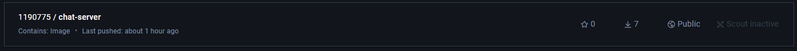
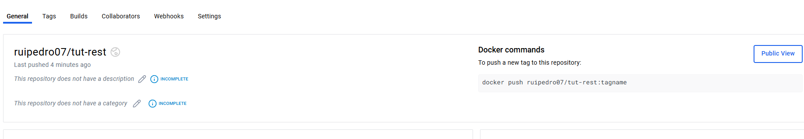
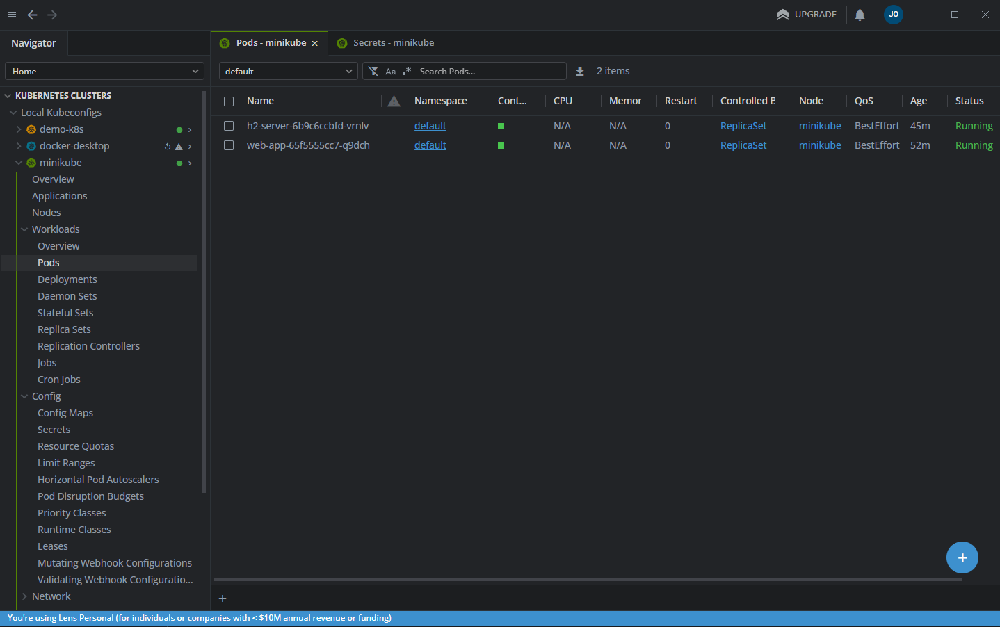
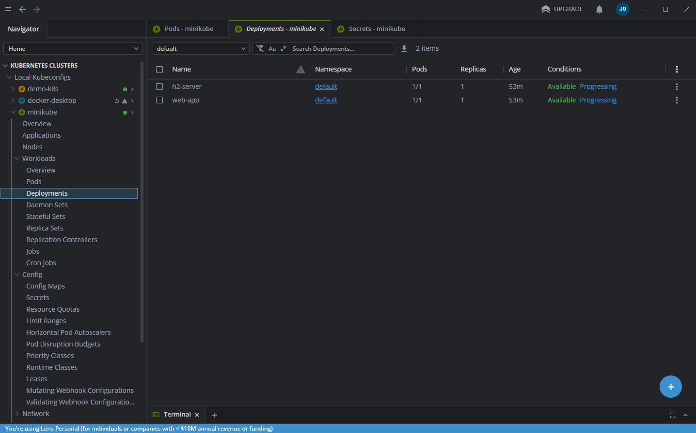
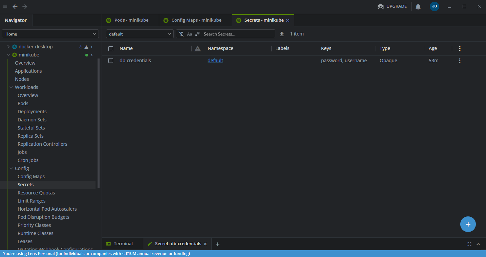
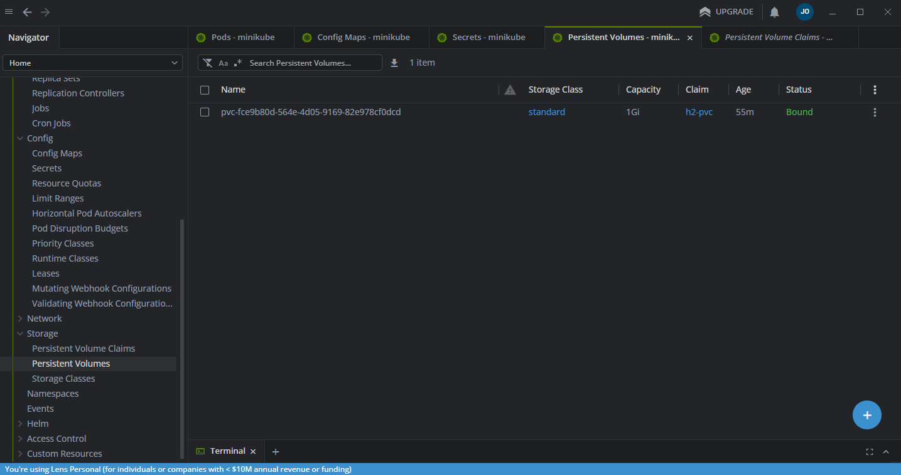
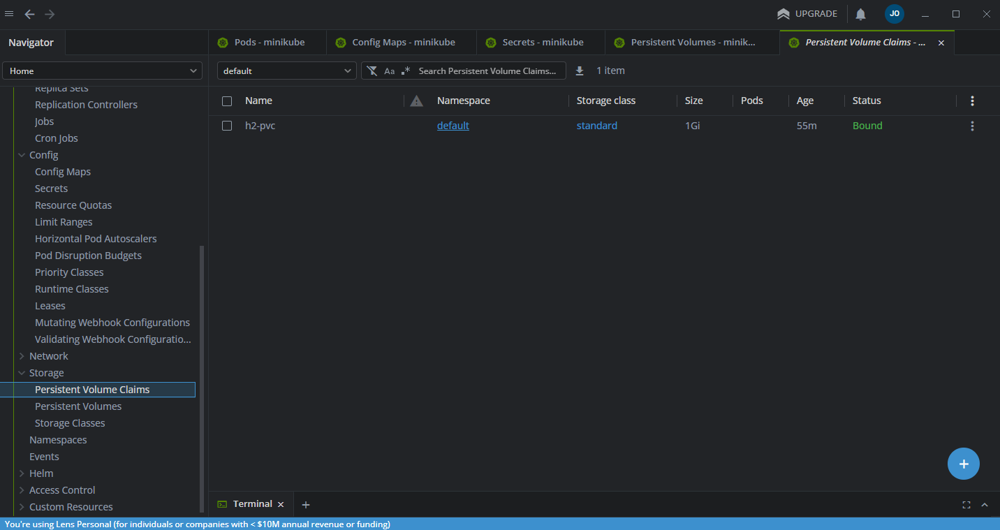

# CA5 - Containers

## Part 1 - First week

The goal of the Part 1 of this assignment is to gain hands-on
experience with Docker by creating separate images and
containers for each CA2 application. And you should start by installing docker: https://docs.docker.com/desktop/setup/install/windows-install/

### Package the server to run inside a container

To explore Docker image concepts, create two versions of your solution:

- **Version 1**: Build the server within the Dockerfile itself (clone your repo
  and build the server inside the container)
- **Version 2**: Build the server on your host machine and copy the resulting
  JAR file into the Docker image

https://<TOKEN>@github.com/ruipedro07/cogsi2425_1191048_1190713_1190775.git

### Chat Server

#### Version 1

For version 1, the Dockerfile is as follows:

```dockerfile
# Use a base image with OpenJDK
FROM openjdk:17-alpine

# Set the working directory inside the container
WORKDIR /app

# Install git to clone the repository
RUN apk add --no-cache git

# Clone the repository directly into the container
RUN git clone https://<TOKEN>@github.com/ruipedro07/cogsi2425_1191048_1190713_1190775.git /app

# Navigate to the chat application directory
WORKDIR /app/CA2/gradle_basic_demo-main

# Set executable permissions for gradlew
RUN chmod +x ./gradlew

# Build the application
RUN ./gradlew build

# Expose the port used by the chat server
EXPOSE 59001

# Run the chat server
CMD ["./gradlew", "runServer"]
```

This version uses the `openjdk:17-alpine` image for its efficiency. We install Git to clone the repository, navigate to the project folder, and build the app. Finally, we expose port `59001` for the chat server and set the command to run it.

To build and run this version:

- `docker build -t chat-server-image-v1 .` creates the image.
- `docker run -p 59001:59001 chat-server-image-v1` runs the container, mapping port `59001` to the host.

#### Version 2

For version 2, we simplified the process by copying the pre-built JAR:

```dockerfile
# Use a base image with OpenJDK
FROM openjdk:17-alpine

# Copy the pre-built JAR file from the host to the container
COPY CA2/gradle_basic_demo-main/build/libs/basic_demo-0.1.0.jar /app/server.jar

# Set the working directory inside the container
WORKDIR /app

# Expose the port used by the chat server
EXPOSE 59001

# Run the server JAR
CMD ["java", "-cp", "/app/server.jar", "basic_demo.ChatServerApp", "59001"]
```

In this version, we avoid building the application inside the container and instead copy the pre-built JAR file. The rest of the steps are similar: expose port `59001` and set the command to run the server.

To build and run this version:

- `docker build -t chat-server-image-v2 -f ./CA5/Part1/ChatApplication/Version2/Dockerfile .` creates the image.
  Note that for this build
  we must run the command in the root of the repository, in order to have access to the
  CA2 build that we have to do beforehand, hence the specified path for the Dockerfile.
- `docker run -p 59001:59001 chat-server-image-v2` runs the container, mapping port `59001` to the host.

### REST Service

#### Version 1

For version 1 of the REST service, the Dockerfile is:

```dockerfile
# Use a base image with OpenJDK
FROM openjdk:17-alpine

# Install git to clone the repository
RUN apk add --no-cache git

# Set the working directory inside the container
WORKDIR /app

# Clone the repository
RUN git clone https://<TOKEN>@github.com/ruipedro07/cogsi2425_1191048_1190713_1190775.git /app

# Set the working directory for the REST service
WORKDIR /app/CA2/tut-rest

# Grant execute permissions to the gradlew script
RUN chmod +x ./gradlew

# Build the REST service using Gradle
RUN ./gradlew build

# Start the Spring Boot REST service using gradlew bootRun
CMD ["./gradlew", "bootRun"]
```

This Dockerfile follows a similar approach to version 1 of the chat server: Git is installed, the repository is cloned, and the REST service is built with Gradle. The application is started using `./gradlew bootRun`.

To build and run this version:

- `docker build -t rest-service-image-v1 .` creates the image.
- `docker run -p 59001:59001 rest-service-image-v1` runs the container, mapping port `59001` to the host.

#### Version 2

For version 2, we copy the pre-built JAR file:

```dockerfile
# Use a base image with OpenJDK
FROM openjdk:17-alpine

# Set the working directory inside the container
WORKDIR /app

# Copy the built JAR file from the host machine into the container
COPY CA2/tut-rest/app/build/libs/app.jar /app/rest-service.jar

# Expose the port used by the REST service (8080)
EXPOSE 8080

# Run the Spring Boot application (the JAR file copied from the host)
CMD ["java", "-jar", "/app/rest-service.jar"]
```

In this version, we copy the pre-built JAR file into the container and run it with `java -jar`. This version skips building the application inside the container, which simplifies and speeds up the process.

To build and run this version:

- `docker build -t rest-service-image-v2 -f ./CA5/Part1/RESTApplication/Version2/Dockerfile .` creates the image.
  Note that for this build
  we must run the command in the root of the repository, in order to have access to the
  CA2 build that we have to do beforehand, hence the specified path for the Dockerfile.
- `docker run -p 59001:59001 rest-service-image-v2` runs the container, mapping port `59001` to the host.

### Display the history of each image, showing each layer and command used to create the image

To display the history of a Docker image, showing each layer and the command used to create the image,
you use the `docker history <image name>` command.
This command provides a detailed breakdown of the image's layers,
the commands that were executed to build each layer, and the size of each layer.

Example of the output:

```bash
IMAGE          CREATED          CREATED BY                                      SIZE      COMMENT
7cd5a0ed489d   53 minutes ago   CMD ["./gradlew" "runServer"]                   0B        buildkit.dockerfile.v0
<missing>      53 minutes ago   EXPOSE map[59001/tcp:{}]                        0B        buildkit.dockerfile.v0
<missing>      53 minutes ago   RUN /bin/sh -c ./gradlew build # buildkit       166MB     buildkit.dockerfile.v0
<missing>      53 minutes ago   RUN /bin/sh -c chmod +x ./gradlew # buildkit    8.76kB    buildkit.dockerfile.v0
<missing>      53 minutes ago   WORKDIR /app/CA2/gradle_basic_demo-main         0B        buildkit.dockerfile.v0
<missing>      53 minutes ago   RUN /bin/sh -c git clone https://<TOKEN>@GIT…   10.3MB    buildkit.dockerfile.v0
<missing>      53 minutes ago   RUN /bin/sh -c apk add --no-cache git # buil…   13.1MB    buildkit.dockerfile.v0
<missing>      53 minutes ago   WORKDIR /app                                    0B        buildkit.dockerfile.v0
```

### Explore the concept of multi-stage builds and see if you can reduce the final image size

Exploring the concepts of multi-staging, we found an opportunity to use
it in Version 1 because the image needs to build the application inside the
container, which involves unnecessary build tools (like Git and Gradle)
that could be excluded from the final runtime image. Multi-staging allows us to
separate the build environment from the runtime environment, resulting in a cleaner,
smaller image. In contrast, Version 2 copies a pre-built JAR file into the container,
eliminating the need for a build step and making multi-staging unnecessary,
as the image only contains the final runtime artifact.

With this said, this is the multistage version for the Chat Server:

```dockerfile
# Stage 1: Build the application
FROM openjdk:17-alpine AS build

# Set the working directory inside the build container
WORKDIR /app

# Install git to clone the repository
RUN apk add --no-cache git

# Clone the repository
RUN git clone https://<TOKEN>@github.com/ruipedro07/cogsi2425_1191048_1190713_1190775.git /app

# Navigate to the chat application directory
WORKDIR /app/CA2/gradle_basic_demo-main

# Set executable permissions for gradlew
RUN chmod +x ./gradlew

# Build the application
RUN ./gradlew build

# Stage 2: Create a minimal runtime image
FROM openjdk:17-alpine

# Set the working directory inside the runtime container
WORKDIR /app

# Copy the built JAR file from the build stage
COPY --from=build /app/CA2/gradle_basic_demo-main/build/libs/basic_demo-0.1.0.jar /app/chat-server.jar

# Expose the port used by the chat server
EXPOSE 59001

# Run the chat server
CMD ["java", "-jar", "/app/chat-server.jar"]
```

In the multi-stage version, we separated the image creation process into two stages,
being the main changes:

**Build Stage**:

- Added a `FROM openjdk:17-alpine AS build` to create a build environment.
- Used RUN `git clone` and `RUN ./gradlew build` to compile the application.

**Runtime Stage**:

- The key addition: `COPY --from=build` was used to copy the JAR file from the build stage into the runtime image.

The same has been made for the multi-stage version of the REST Service:

```dockerfile
# Stage 1: Build the application
FROM openjdk:17-alpine AS build

# Install git to clone the repository
RUN apk add --no-cache git

# Set the working directory inside the build container
WORKDIR /app

# Clone the repository
RUN git clone https://<TOKEN>@github.com/ruipedro07/cogsi2425_1191048_1190713_1190775.git /app

# Set the working directory for the REST service
WORKDIR /app/CA2/tut-rest

# Grant execute permissions to the gradlew script
RUN chmod +x ./gradlew

# Build the REST service using Gradle
RUN ./gradlew build

# Stage 2: Create a minimal runtime image
FROM openjdk:17-alpine

# Set the working directory inside the runtime container
WORKDIR /app

# Copy the built JAR file from the build stage
COPY --from=build /app/CA2/tut-rest/app/build/libs/app.jar /app/rest-service.jar

# Expose the port used by the REST service
EXPOSE 8080

# Start the Spring Boot REST service
CMD ["java", "-jar", "/app/rest-service.jar"]
```

### Monitor container resource consumption in real-time

The `docker stats` command provides real-time monitoring of container resource consumption.

An example of the output is this:

```bash
CONTAINER ID   NAME              CPU %     MEM USAGE / LIMIT     MEM %     NET I/O       BLOCK I/O   PIDS
53b7f76ffb52   boring_pascal     0.08%     43.69MiB / 7.664GiB   0.56%     796B / 0B     0B / 0B     20
0de375c024d1   reverent_galois   0.27%     222.7MiB / 7.664GiB   2.84%     1.09kB / 0B   0B / 0B     55
```

### Tag your images and publish them in Docker Hub

To tag and publish Docker images on Docker Hub:

1. **Tag the image**: Use `docker tag <existing-image> <username>/<repository>:<tag>` to give your image a meaningful name and version. Example:

```bash
docker tag chat-server-image-v1 1190775/chat-server:v1
```

2. **Log in to Docker Hub**: Run docker login and enter your Docker Hub credentials, or directly in Docker Desktop.

3. **Push the image**: Use `docker push <username>/<repository>:<tag>` to upload the image to Docker Hub. Example:

```bash
docker push 1190775/chat-server:v1
```

4. Verify: Check your Docker Hub repository to ensure the image is uploaded.
   

## Part 2: Dockerizing a Spring Application with H2 Database

### **Step 1: Web Dockerfile Creation**

To start, you’ll need to create a Dockerfile for your **web** service, which will run the Spring Boot application. Below is the Dockerfile that we used for our project.

#### **Web Dockerfile**:

This Dockerfile uses an OpenJDK base image, installs necessary dependencies, builds the Spring Boot application with Gradle, and finally runs the application inside the container.

```dockerfile
# Use a base image with OpenJDK
FROM openjdk:17-alpine

# Install git to clone the repository
RUN apk add --no-cache git

# Set the working directory inside the container
WORKDIR /app

# Copy the application code into the container
COPY . /app

# Grant execute permissions to the gradlew script
RUN chmod +x ./gradlew

# Build the REST service using Gradle
RUN ./gradlew build

# Start the Spring Boot REST service using gradlew bootRun
CMD ["./gradlew", "bootRun"]
```

### **Step 2: Publish the Web Image to Docker Hub**

Once the Dockerfile is ready and you’ve built your image, the next step is to publish it to Docker Hub.

#### **Build the Docker Image**:

To build the Docker image locally, run the following command in the terminal from the directory containing the `Dockerfile`:

```bash
docker build -t <username>/tut-rest:1.0 .
```

Explanation:

- `-t <username>/tut-rest:1.0`: This tags the image with the name `<username>/tut-rest` and version `1.0`. Replace `<username>` with your Docker Hub username.

#### **Log in to Docker Hub**:

Before you can push the image to Docker Hub, you need to log in to your Docker Hub account:

```bash
docker login
```

Enter your Docker Hub username and password when prompted.

#### **Push the Docker Image**:

After successfully building the image, push it to Docker Hub using the following command:

```bash
docker push <username>/tut-rest:1.0
```

This uploads the image to your Docker Hub repository. You can verify this by visiting your Docker Hub account and checking that the image `ruipedro07/tut-rest:1.0` is listed in your repositories.

Result in Docker Hub Website:



### **Step 3: Docker Compose Setup**

Now that the web image is published, let’s move on to configuring Docker Compose, which will manage both the Spring Boot application and the H2 database.

#### **Docker Compose File**:

In this section, we define the configuration for two services: the **web** service (Spring Boot application) and the **h2Server** service (H2 database). The goal is to ensure these services run in separate containers, but can still communicate with each other through a shared network.

Here is the `docker-compose.yml` file:

```yaml
version: "3.9"

services:
  h2Server:
    image: oscarfonts/h2 # Using an existing H2 image from Docker Hub
    container_name: h2db
    environment:
      H2_OPTIONS: "-tcp -ifNotExists -tcpAllowOthers -baseDir /h2"
      H2_TCP_PORT: "1521"
      H2_USER: ${DB_USER}
      H2_PASSWORD: ${DB_PASSWORD}
    volumes:
      - ./h2_data:/h2 # Mounting volume to persist data
    networks:
      - app-network
    healthcheck:
      test:
        ["CMD", "bash", "-c", "ps aux | grep -- '-tcpPort 1521' | grep -v grep"]
      interval: 5s
      retries: 3
      timeout: 10s

  web:
    image: ruipedro07/tut-rest:1.0 # Custom image for the Spring Boot app
    container_name: web-container
    depends_on:
      h2Server:
        condition: service_healthy # Wait until the H2 service is healthy
    networks:
      - app-network
    ports:
      - "8080:8080" # Expose port 8080 for the Spring Boot application
    environment:
      - SPRING_PROFILES_ACTIVE=prod
      - DB_USER=${DB_USER}
      - DB_PASSWORD=${DB_PASSWORD}
      - DB_URL=jdbc:h2:tcp://h2db:1521/data;IFEXISTS=FALSE # Configure Spring DB connection
    restart: unless-stopped

networks:
  app-network:
    driver: bridge
```

#### **Explanation of Docker Compose**:

1. **h2Server**:

- Uses the pre-built `oscarfonts/h2` image from Docker Hub for the H2 database.
- Configures environment variables like `H2_USER` and `H2_PASSWORD` for authentication, and also mounts a volume to persist data (`./h2_data:/h2`).
- Includes a **healthcheck** to verify the database server is running before the web service starts.

2. **web**:

- Runs the Spring Boot application using the image `ruipedro07/tut-rest:1.0`.
- The `depends_on` directive ensures that the **web** container only starts after the **h2Server** container is healthy.
- The `DB_URL` connects to the H2 database running on the `h2db` container. This allows the Spring Boot application to connect to the database within the Docker network.

3. **Networks**:

- Both containers are connected to the `app-network` to enable communication between them.

### **Step 4: Testing the Network and Database Connectivity**

To ensure that the web application and the H2 database can communicate properly, you should test the network connectivity and database connection.

1. **Run Docker Compose**:
   Use the following command to start the containers defined in the `docker-compose.yml` file:

   ```bash
   docker-compose up
   ```

2. **Verify Connectivity**:
   You can verify that the **web** container can reach the **h2Server** by checking the logs of the **web** container for any database connection errors. If the Spring Boot application starts successfully without issues, the containers are communicating properly.

3. **Health Check Verification**:
   Docker Compose uses the healthcheck for the `h2Server`. If the H2 container is not healthy, the **web** container will not start.

### **Step 5: Persisting Data with Volumes**

The database file for H2 is persisted using a **volume** in the `docker-compose.yml` file:

```yaml
volumes:
  - ./h2_data:/h2
```

This ensures that the H2 database data is stored outside the container in the `./h2_data` directory, allowing it to be reused even after containers are stopped or removed.

## Alternative - Kubernetes

### How to Set Up Kubernetes and Mount a Volume into Minikube

1. Install Minikube:
   - Download and install Minikube from the official [Minikube installation guide](https://minikube.sigs.k8s.io/docs/start/?arch=%2Fwindows%2Fx86-64%2Fstable%2F.exe+download).
2. Start Minikube:
   - Open a PowerShell with admin rights and start Minikube:
   ```shell
    minikube start
   ```
3. Mount a Volume into Minikube:
   - Use the `minikube mount` command to mount a directory from your host machine into Minikube. For example, to mount `<project-root>\CA2` to `/CA2` in Minikube:
     (Run the command on the root folder of this repository)
   ```shell
    minikube mount "$(Get-Location)\CA2:/CA2"
   ```

### Basic Explanation on How Kubernetes Works and How the Config Files are Created and Managed

1. **Kubernetes Overview**:
   - Kubernetes is an open-source platform designed to automate deploying, scaling, and operating application containers. It groups containers that make up an application into logical units for easy management and discovery.
2. **Kubernetes Components**:
   - **Pod**: The smallest and simplest Kubernetes object. A pod represents a single instance of a running process in your cluster.
   - **Deployment**: A higher-level concept that manages a set of identical pods, ensuring that the desired number of pods are running.
   - **Service**: An abstraction that defines a logical set of pods and a policy by which to access them.
   - **PersistentVolume (PV)**: A piece of storage in the cluster that has been provisioned by an administrator or dynamically provisioned using Storage Classes.
   - **PersistentVolumeClaim (PVC)**: A request for storage by a user. It is similar to a pod.
3. **Creating and Managing Config Files**:
   - Kubernetes uses YAML files to define the desired state of your application. These files are used to create and manage Kubernetes objects.
     - Example Deployment YAML:
       ```yaml
       apiVersion: apps/v1
       kind: Deployment
       metadata:
         name: chat-app-v1
       spec:
         replicas: 1
         selector:
           matchLabels:
             app: chat-app-v1
         template:
           metadata:
             labels:
               app: chat-app-v1
           spec:
             containers:
               - name: chat-app
                 image: openjdk:17-alpine
                 ports:
                   - containerPort: 59001
                 volumeMounts:
                   - name: app-jar
                     mountPath: /app
                 command: ["./app/gradlew", "runServer"]
             volumes:
               - name: app-jar
                 hostPath:
                   type: Directory
                   path: /CA2/gradle_basic_demo-main
       ```
   - **Applying Config Files**:
     - Use the `kubectl apply` command to create and manage Kubernetes objects defined in YAML files:
     ```shell
     kubectl apply -f deployment-chat-v1.yaml
     ```
   - **Checking Pod Status**:
     - Use the `kubectl get pods` command to check the status of your pods:
     ```shell
      kubectl get pods
     ```
   - **Viewing Logs**:
     - Use the `kubectl logs` command to view the logs of a specific pod:
     ```shell
      kubectl logs <pod-name>
     ```
   - **Viewing Pod Events**:
     - Use the `kubectl describe pod` command to view the multiple information about the pod, including some events that may be usefull for debuging the configuration file:
     ```shell
      kubectl describe pod <pod-name>
     ```

By following these steps, you can set up Kubernetes, mount volumes into Minikube, and understand the basic concepts and management of Kubernetes configuration files. This approach provides a scalable and robust solution for deploying your applications.

### Practical Examples:

#### Part 1: Kubernetes Deployment for Chat and REST Applications

##### Chat Application

###### Version 1

For the multi-stage build version of the chat application, use the following Kubernetes deployment configuration:

```yaml
# filepath: CA5/Alternative/Part1/ChatApplication/Version1/deployment-chat-v1.yaml
apiVersion: apps/v1
kind: Deployment
metadata:
  name: chat-app-v1
spec:
  replicas: 1
  selector:
    matchLabels:
      app: chat-app-v1
  template:
    metadata:
      labels:
        app: chat-app-v1
    spec:
      containers:
        - name: chat-app
          image: openjdk:17-alpine
          ports:
            - containerPort: 59001
          volumeMounts:
            - name: app-jar
              mountPath: /app
          command: ["./app/gradlew", "runServer"]
      volumes:
        - name: app-jar
          hostPath:
            type: Directory
            path: /CA2/gradle_basic_demo-main
```

###### Version 2

For the pre-built JAR version of the chat application, use the following Kubernetes deployment configuration:

```yaml
# filepath: CA5/Alternative/Part1/ChatApplication/Version2/deployment-chat-v2.yaml
apiVersion: apps/v1
kind: Deployment
metadata:
  name: chat-app-v2
spec:
  replicas: 1
  selector:
    matchLabels:
      app: chat-app-v2
  template:
    metadata:
      labels:
        app: chat-app-v2
    spec:
      containers:
        - name: chat-app
          image: openjdk:17-alpine
          ports:
            - containerPort: 59001
          volumeMounts:
            - name: app-jar
              mountPath: /app
          command:
            [
              "java",
              "-cp",
              "/app/server.jar",
              "basic_demo.ChatServerApp",
              "59001",
            ]
      volumes:
        - name: app-jar
          hostPath:
            type: Directory
            path: /CA2/gradle_basic_demo-main/build/libs/basic_demo-0.1.0.jar
```

##### REST Application

###### Version 1

For the multi-stage build version of the REST application, use the following Kubernetes deployment configuration:

```yaml
# filepath: CA5/Alternative/Part1/RESTApplication/Version1/Multistage/deployment-rest-v1-multistage.yaml
apiVersion: apps/v1
kind: Deployment
metadata:
  name: rest-app-v1
spec:
  replicas: 1
  selector:
    matchLabels:
      app: rest-app-v1
  template:
    metadata:
      labels:
        app: rest-app-v1
    spec:
      containers:
        - name: rest-app
          image: openjdk:17-alpine
          ports:
            - containerPort: 8080
          volumeMounts:
            - name: app-jar
              mountPath: /app
          command: ["./gradlew", "bootRun"]
      volumes:
        - name: app-jar
          hostPath:
            type: Directory
            path: /CA2/tut-rest
```

###### Version 2

For the pre-built JAR version of the REST application, use the following Kubernetes deployment configuration:

```yaml
# filepath: CA5/Alternative/Part1/RESTApplication/Version2/deployment-rest-v2.yaml
apiVersion: apps/v1
kind: Deployment
metadata:
  name: rest-app-v2
spec:
  replicas: 1
  selector:
    matchLabels:
      app: rest-app-v2
  template:
    metadata:
      labels:
        app: rest-app-v2
    spec:
      containers:
        - name: rest-app
          image: openjdk:17-alpine
          ports:
            - containerPort: 8080
          volumeMounts:
            - name: app-jar
              mountPath: /app
          command: ["java", "-jar", "/app/rest-service.jar"]
      volumes:
        - name: app-jar
          hostPath:
            # Update the path to the JAR file. Kubernets does not support relative paths.
            type: Directory
            path: /CA2/tut-rest/app/build/libs/app.jar
```

#### Part 2: Kubernetes Deployment for Spring Application with H2 Database

For Part 2, use the following Kubernetes deployment configuration:

```yaml
# filepath: CA5/Alternative/Part2/k8s-deployments.yaml
apiVersion: apps/v1
kind: Deployment
metadata:
  name: h2-server
spec:
  replicas: 1
  selector:
    matchLabels:
      app: h2-server
  template:
    metadata:
      labels:
        app: h2-server
    spec:
      containers:
        - name: h2-server
          image: oscarfonts/h2
          ports:
            - containerPort: 1521
          env:
            - name: H2_OPTIONS
              value: "-tcp -ifNotExists -tcpAllowOthers -baseDir /h2"
            - name: H2_TCP_PORT
              value: "1521"
            - name: H2_USER
              valueFrom:
                secretKeyRef:
                  name: db-credentials
                  key: username
            - name: H2_PASSWORD
              valueFrom:
                secretKeyRef:
                  name: db-credentials
                  key: password
          volumeMounts:
            - name: h2-data
              mountPath: /h2
      volumes:
        - name: h2-data
          hostPath:
            path: /mnt/data/h2
            type: DirectoryOrCreate

---
apiVersion: v1
kind: Service
metadata:
  name: h2-service
spec:
  selector:
    app: h2-server
  ports:
    - protocol: TCP
      port: 1521
      targetPort: 1521

---
apiVersion: apps/v1
kind: Deployment
metadata:
  name: web-app
spec:
  replicas: 1
  selector:
    matchLabels:
      app: web-app
  template:
    metadata:
      labels:
        app: web-app
    spec:
      containers:
        - name: web-app
          image: ruipedro07/tut-rest:1.0
          ports:
            - containerPort: 8080
          env:
            - name: SPRING_PROFILES_ACTIVE
              value: "prod"
            - name: DB_USER
              valueFrom:
                secretKeyRef:
                  name: db-credentials
                  key: username
            - name: DB_PASSWORD
              valueFrom:
                secretKeyRef:
                  name: db-credentials
                  key: password
            - name: DB_URL
              value: "jdbc:h2:tcp://h2-service:1521/data;IFEXISTS=FALSE"

---
apiVersion: v1
kind: Service
metadata:
  name: web-service
spec:
  selector:
    app: web-app
  ports:
    - protocol: TCP
      port: 8080
      targetPort: 8080
  type: LoadBalancer

---
apiVersion: v1
kind: PersistentVolumeClaim
metadata:
  name: h2-pvc
spec:
  accessModes:
    - ReadWriteOnce
  resources:
    requests:
      storage: 1Gi

---
apiVersion: v1
kind: Secret
metadata:
  name: db-credentials
type: Opaque
data:
  username: YWRtaW4=
  password: YWRtaW5fcGFzc3dvcmQ=
```

##### Images from Lens (Equivalent to Docker Desktop)

- **Pods**:
  
- **Deployments**:
  
- **Secrets**:
  
- **PersistentVolume (PV)**:
  
- **PersistentVolumeClaim (PVC)**:
  

### Conclusion

In this section, we provided Kubernetes alternatives for both Part 1 and Part 2 of the assignment. These configurations allow you to deploy the chat and REST applications, as well as the Spring application with an H2 database, using Kubernetes. This approach offers a more scalable and robust solution compared to Docker Compose.
