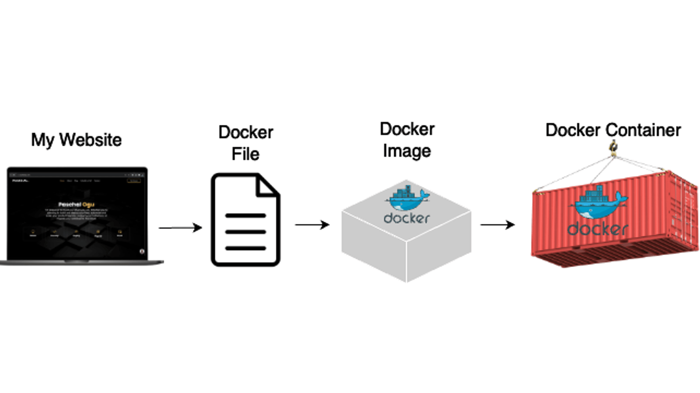
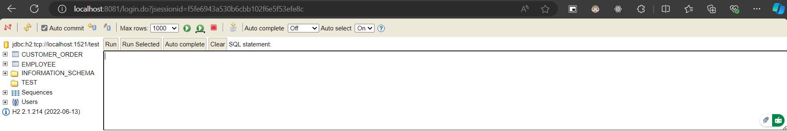
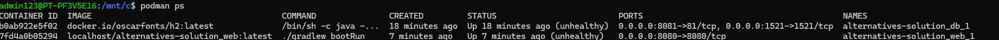

## CA2 - COGSI_C Group

* Afonso Bertão - 1190327
* Rodrigo Costa - 1191014
* Wimy Carvalho - 1161297

## CA5 - Containers


### Introduction

Containers are a lightweight and portable way to package applications and their dependencies together. They allow applications to run consistently across various environments, from a developer's laptop to production servers. Docker, the most popular container platform, enables developers to create, deploy, and manage containers efficiently. Containers ensure consistency, scalability, and efficiency, making them an essential tool for modern application development and deployment.



Key concepts:

- **Container**: A lightweight, standalone executable package that includes everything needed to run a piece of software, including the code, runtime, libraries, and system tools.
- **Dockerfile**: A script containing instructions to assemble a Docker image. It defines how to package the application and its dependencies.
- **Image**: A read-only template used to create containers. Images are built from a Dockerfile.
- **Registry**: A storage and distribution system for Docker images. Docker Hub is a widely used public registry.
- **Volumes**: A mechanism for persisting data generated by and used in Docker containers.

Benefits of Using Containers:

- **Portability**: Ensures the application works the same in development, testing, and production environments.
- **Isolation**: Applications run independently, avoiding conflicts between dependencies.
- **Scalability**: Simplifies scaling applications across multiple environments.

Types of Build Tools:

- **Docker**: The core tool for building, running, and managing containers.

- **Kubernetes**: An orchestration platform for automating deployment, scaling, and management of containerized applications.

- **Podman**:A Docker-compatible container engine that doesn’t require a daemon.

- **Docker Compose**: A tool for defining and running multi-container Docker applications using a YAML file (docker-compose.yml).

- **Containerd**: A container runtime that manages container lifecycles, used by Docker and Kubernetes.

- **Buildah**: A tool for building OCI-compliant container images without requiring a Docker daemon.

- **CRIU (Checkpoint/Restore in Userspace)**: A tool to freeze a running container and restore it later.

### Analysis of the problem


The objective of this assignment is to understand and use Docker, a popular containerization tool, to build, manage, and run containerized applications. The focus is on creating Docker images, managing container lifecycles, and automating deployment processes.

**Basic Gradle Workflow**:

The basic workflow involves creating a Dockerfile, building an image, running the container, and deploying the application:

- Common steps:
    - `docker build -t <image_name> .` (build a Docker image from a Dockerfile).
    - `docker run -p <host_port>:<container_port> <image_name>` (run a container and expose the application on a specific port).
    - `docker ps` (list running containers).
    - `docker stop <container_id>` (stop a running container).
    - `docker push <repository_name>:<tag>` (push the image to a Docker registry).

### Solution

Part1

The goal of the Part 1 of this assignment is to gain hands-on experience with Docker by creating separate images and containers for each CA2 application:
- An image for the chat application
- An image for the Building REST services with Spring application

1. Create Docker images for your chat application and the REST services application. Below are the steps and Dockerfile examples for both versions of the solution.
- Version 1: Build the server within the Dockerfile itself (clone your repo and build the server inside the container)

Chat application v1

```Dockerfile
# Use an official OpenJDK runtime as a parent image
FROM openjdk:17-jdk-slim

# Set the working directory
WORKDIR /app

# Clone the repository
RUN apt-get update && apt-get install -y git \
    && git clone https://github.com/lmpnogueira/gradle_basic_demo . \
    && ./gradlew build

# Expose the port the server will run on
EXPOSE 59001

# Run the server
CMD ["java", "-cp", "build/libs/basic_demo-0.1.0.jar", "basic_demo.ChatServerApp", "59001"]
```
Building REST services with Spring application v1

```Dockerfile
# Use an official OpenJDK runtime as a parent image
FROM openjdk:17-jdk-slim

# Set the working directory
WORKDIR /app

# Clone the repository
RUN apt-get update && apt-get install -y git \
    && git clone https://github.com/spring-guides/tut-rest.git . \
    && ./mvnw package

# Expose the port the server will run on
EXPOSE 8080

# Run the server
CMD ["java", "-jar", "links/target/links-0.0.1-SNAPSHOT.jar"]
```

- Version 2: Build the server on your host machine and copy the resulting JAR file into the Docker image

Chat application v2

```Dockerfile
# Use an official OpenJDK runtime as a parent image
FROM openjdk:17-jdk-slim

# Set the working directory
WORKDIR /app

# Copy the JAR file from the host machine to the container
COPY build/libs/basic_demo-0.1.0.jar /app/basic_demo-0.1.0.jar

# Expose the port the server will run on
EXPOSE 59002

# Run the server
CMD ["java", "-cp", "basic_demo-0.1.0.jar", "basic_demo.ChatServerApp", "59001"]
```

Building REST services with Spring application v2

```Dockerfile
# Use an official OpenJDK runtime as a parent image
FROM openjdk:17-jdk-slim

# Set the working directory
WORKDIR /app

# Copy the JAR file from the host machine to the container
COPY links/target/links-0.0.1-SNAPSHOT.jar /app/rest-services-application.jar

# Expose the port the server will run on
EXPOSE 8081

# Run the server
CMD ["java", "-jar", "rest-services-application.jar"]
```


2. Build the Docker images:
   
Use the docker build command to create Docker images from the specified Dockerfiles. Each image corresponds to a specific version of the REST services and chat applications. The -t flag assigns a tag for easy identification, and -f specifies the Dockerfile.
    
   ```bash
   docker build -t rest-services-application:v1 -f Dockerfilev1 .
   docker build -t chat-application:v1 -f DockerfileChatv1 .
   docker build -t rest-services-application:v2 -f Dockerfilev2 .
   docker build -t chat-application:v2 -f DockerfileChatv2 .
   ```

3. Run the Docker containers:

Use the docker run command to start the containers based on the created images. The -d flag runs the container in detached mode, and -p maps the host port to the container port. The --name flag assigns a name to the container for easy reference.

   ```bash 
    docker run -d -p 8080:8080 --name rest-server-v1 rest-services-application:v1
    docker run -d -p 59001:59001 --name chat-server-v1 chat-application:v1
    docker run -d -p 8081:8081 --name rest-server-v2 rest-services-application:v2
    docker run -d -p 59002:59002 --name chat-server-v2 chat-application:v2
   ```
Docker Desktop Running Containers


4. Displaying the History of Each Image:

The docker history command shows the history of each image, including the commands used to create it. This information can help identify the layers and commands that contribute to the image's size and content.

```bash 
docker history chat-application:v1
docker history rest-services-application:v1
docker history chat-application:v2
docker history rest-services-application:v2
```
Docker History
Chat Application v1

Rest Services Application v1

Chat Application v2

Rest Services Application v2


5. Monitor Container Resource Consumption

The docker stats command provides real-time information about the resource consumption of running containers, including CPU, memory, and network usage. This data can help monitor and optimize container performance.

```bash
docker stats
```
Docker Monitoring


6. Tag Images for Docker Hub

Tag the Docker images with your Docker Hub username to prepare for publishing. This step ensures that the images are correctly identified and associated with your Docker Hub account.

```bash
docker tag rest-services-application:v1 1190327/rest-services-application:v1
docker tag chat-application:v1 1190327/chat-application:v1
docker tag rest-services-application:v2 1190327/rest-services-application:v2
docker tag chat-application:v2 1190327/chat-application:v2
```

7. Publish Images to Docker Hub

Use the docker push command to upload the tagged images to Docker Hub. This step makes the images publicly available for others to use and deploy.

```bash
docker push 1190327/rest-services-application:v1
docker push 1190327/chat-application:v1
docker push 1190327/rest-services-application:v2
docker push 1190327/chat-application:v2
```
Docker Hub

Building REST services with Spring application

Chat application


Part2

1. The goal of Part 2 is to use Docker to create a containerized
   environment for running the Gradle version of the "Building
   REST Services with Spring" application
   - You are required to develop a solution similar to Part 2 of CA3, but this
   time using Docker instead of Vagrant
    - The solution should include a Dockerfile that builds an image for the web and database services

Building REST Services with Spring application - Gradle version

```Dockerfile
# Use an official OpenJDK runtime as a parent image
FROM openjdk:20-jdk-slim

# Set the working directory
WORKDIR /app

# Copy the application JAR file to the container
COPY app/build/libs/app.jar /app/app.jar

# Set the correct permissions for the JAR file
RUN chmod +x /app/app.jar

# Expose the port the server will run on
EXPOSE 8080

# Run the server
CMD ["java", "-jar", "app.jar"]
```

H2 database server

```Dockerfile
# Dockerfile.db
FROM oscarfonts/h2

COPY init.sql /docker-entrypoint-initdb.d/init.sql

EXPOSE 1521
```

2.  Use Docker Compose to create two containers
    - web: this container will host the Spring application
    - db: this container will run the H2 database server

Define the services in a docker-compose.yml file, including the build context, Dockerfile, ports, environment variables, and health checks.
With this configuration, Docker Compose will create and manage the containers based on the specified services.

Docker Compose.yml

```Dockerfile
version: '3.8'

services:
  web:
    build:
      context: .
      dockerfile: Dockerfileweb
    ports:
      - "8080:8080"
    depends_on:
      - db
    environment:
      SPRING_DATASOURCE_URL: jdbc:h2:tcp://db:1521/mem:testdb;INIT=RUNSCRIPT FROM 'file:/docker-entrypoint-initdb.d/init.sql'
      SPRING_DATASOURCE_USERNAME: ${DB_USERNAME:-sa}
      SPRING_DATASOURCE_PASSWORD: ${DB_PASSWORD:-password}
    healthcheck:
      test: ["CMD", "curl", "-f", "http://localhost:8080/actuator/health"]
      interval: 30s
      timeout: 10s
      retries: 3

  db:
    build:
      context: .
      dockerfile: Dockerfiledb
    ports:
      - "1521:1521"
    environment:
      H2_OPTIONS: -tcp -tcpAllowOthers -ifNotExists
      DB_USERNAME: ${DB_USERNAME:-sa}
      DB_PASSWORD: ${DB_PASSWORD:-password}
    volumes:
      - h2-data:/opt/h2-data
    healthcheck:
      test: ["CMD", "curl", "-f", "http://localhost:8082"]
      interval: 30s
      timeout: 10s
      retries: 3

volumes:
  h2-data:
```

3. Build the JAR file with the application:

Build the JAR file for the "Building REST Services with Spring" application using Gradle. This step compiles the source code, runs the tests, and packages the application into a JAR file.

```bash
   ./gradlew build
   ```

4. Build and run the containers using Docker Compose:

Build and run the containers using Docker Compose. The --build flag ensures that the images are built before starting the services. This command creates and manages the web and db containers based on the specified configuration.

```bash
   docker-compose up --build
   ```

Building REST Services with Spring application - Gradle version and H2 database server running


5. Use a volume in the db container to persist the database file and Use Docker Compose environment variables to configure services:

Update the Docker Compose file to include a volume for the H2 database data and environment variables for the database username and password. This configuration ensures that the database file is persisted across container restarts and that the services are correctly configured.

Docker Compose.yml

```Dockerfile
version: '3.8'

services:
  web:
    build:
      context: .
      dockerfile: Dockerfileweb
    ports:
      - "8080:8080"
    depends_on:
      - db
    environment:
      SPRING_DATASOURCE_URL: jdbc:h2:tcp://db:1521/mem:testdb;INIT=RUNSCRIPT FROM 'file:/docker-entrypoint-initdb.d/init.sql'
      SPRING_DATASOURCE_USERNAME: ${DB_USERNAME:-sa}
      SPRING_DATASOURCE_PASSWORD: ${DB_PASSWORD:-password}
    healthcheck:
      test: ["CMD", "curl", "-f", "http://localhost:8080/actuator/health"]
      interval: 30s
      timeout: 10s
      retries: 3

  db:
    build:
      context: .
      dockerfile: Dockerfiledb
    ports:
      - "1521:1521"
    environment:
      H2_OPTIONS: -tcp -tcpAllowOthers -ifNotExists
      DB_USERNAME: ${DB_USERNAME:-sa}
      DB_PASSWORD: ${DB_PASSWORD:-password}
    volumes:
      - h2-data:/opt/h2-data
    healthcheck:
      test: ["CMD", "curl", "-f", "http://localhost:8082"]
      interval: 30s
      timeout: 10s
      retries: 3

volumes:
  h2-data:
```

6. Check Web Image Id from both services:

Check the image IDs for the web and db services to verify that the containers are running the correct images.

```bash
docker images
```
Docker Images


7. Tag Images for Docker Hub

Tag the Docker images with your Docker Hub username to prepare for publishing. This step ensures that the images are correctly identified and associated with your Docker Hub account.

```bash
docker tag c81e6631d86a 1190327/building_rest_services_with_spring_gradle_app-web:latest
docker tag ad7ca5382dc6 1190327/building_rest_services_with_spring_gradle_app-db:latest
```

8. Publish Images to Docker Hub

Use the docker push command to upload the tagged images to Docker Hub. This step makes the images publicly available for others to use and deploy.

```bash
docker push 1190327/building_rest_services_with_spring_gradle_app-web:latest
docker push 1190327/building_rest_services_with_spring_gradle_app-db:latest
```
Docker Hub

Building REST services with Spring application - Gradle version

H2 server


### Alternative Solution

**Podman** 

Podman is a container engine that is compatible with Docker but does not require a daemon to run. It allows users to manage containers, images, and volumes using a command-line interface similar to Docker. Podman can run containers as root or in rootless mode, providing enhanced security by allowing non-privileged users to manage containers. It is often used as a drop-in replacement for Docker in environments where running a daemon is not desirable or possible.

Podman is not based on Docker, it aligns closely with Docker's workflows, making it easier for developers familiar with Docker to transition to Podman.

**Key Differences Between Podman and Docker**

1. Daemonless Architecture
  
    - Docker: Uses a central daemon (dockerd) to manage containers. The daemon runs as a background service with root privileges.
    - Podman: Does not use a daemon. Each Podman container runs as an independent process, which improves security and eliminates the need for a central service.

2. Rootless Containers
    - Docker: Requires additional configuration (e.g., rootless mode) to run containers without root privileges.
    - Podman: Natively supports running containers as a non-root user without requiring elevated privileges.

3. Compatibility with Kubernetes
    - Docker: Requires Docker Compose or similar tools to transition into Kubernetes workflows.
    - Podman: Directly integrates with Kubernetes. You can generate Kubernetes YAML files from Podman containers or pods using: ``podman generate kube``

4. Pod Support
    - Docker: Does not have native support for pods.
    - Podman: Natively supports "pods," a concept borrowed from Kubernetes. A pod is a group of containers sharing the same network and IPC namespace.

5. Image Management
    - Docker: Uses OCI-compliant images but requires the Docker daemon for image management.
    - Podman: Also uses the same container image format (OCI) as Docker, meaning it can pull and run Docker images. Images are managed through registries like Docker Hub or Quay.

6. Command Similarity
Podman aims to be a drop-in replacement for Docker. Many Docker commands can be replaced with Podman commands, such as:
    
    **docker run -> podman run**

    **docker ps   -> podman ps**
    
    **docker build -> podman build**

**Podman Instead of Docker**
| Comparative   | Reasons | 
|---------------|-----------------|
| Security      | The daemonless and rootless architecture makes Podman more secure.  |
| Flexibility   | Podman works seamlessly in environments where a daemon might not be feasible  |
| Lightweight   | Without a central daemon, Podman consumes fewer resources  | 
| Kubernetes Compatibility   | Podman simplifies the transition to Kubernetes workflows. | 

Podman is more suited for running application containers with Docker-compatible workflows and provides a lightweight and daemonless alternative to Docker.

**LXD**

LXD is a container and virtual machine manager built on top of LXC (Linux Containers). It provides a powerful and flexible way to manage system containers, which are lightweight, fast, and isolated environments for running applications. LXD is focused on managing full Linux distributions rather than individual applications, making it ideal for running entire operating systems within containers. It is often compared to virtual machines, but with the efficiency of containers.

| Feature                  | Podman                             | Docker                                | LXD                                    |
|--------------------------|------------------------------------|---------------------------------------|----------------------------------------|
| **Type of Containers**    | Application containers (Docker-like) | Application containers (OCI-based)   | System containers (LXC) and VMs        |
| **Focus**                 | Single applications                | Single applications                   | Full Linux distributions or VMs        |
| **Daemonless**            | Yes                                | No (uses a central daemon: `dockerd`) | Yes                                    |
| **Rootless Support**      | Yes                                | Partial (requires configuration)      | Yes                                    |
| **Kubernetes Compatibility** | Yes (via `podman generate kube`)  | Yes (via Docker Compose integration)  | Yes (via integration with Kubernetes)  |
| **VM Support**            | No                                 | No                                    | Yes                                    |
| **Pod Support**           | Yes                                | No                                    | Yes                                    |
| **Command-Line Tool**     | `podman`                           | `docker`                              | `lxc`                                  |
| **Image Management**      | OCI-compliant                      | OCI-compliant                         | LXC images or VMs                      |


LXD is often used in scenarios where lightweight virtual machines or system containers are required, while Podman is used for application-level containerization.

### Implementation of alternative Solution

To test using `podman-compose`, you need to ensure that `podman` and `podman-compose` are installed on your system. Then, you can use the same `docker-compose.yaml` file with `podman-compose` commands.

1. Install `podman` and `podman-compose` if not already installed.
2. Navigate to the directory containing your `docker-compose.yaml` file.
3. Use the following commands to start and manage your services:

```sh
##### In Windows by using WSL ######
sudo apt-update
sudo apt-install podman
sudo apt-install podman-compose

# Navigate to the directory with the docker-compose.yaml file
cd <docker-compose location>

# Start the services
podman-compose up  // podman-compose up db // podman-compose up web

# To stop the services
podman-compose down

# Build the image
podman build -t myimage:latest .

# Tag the image for the registry, replace yourusername with your Docker Hub username and myimage with your image name(docker.io/yourusername).
podman tag myimage:latest myregistry.com/myimage:latest

# Push the image to the registry
podman push myregistry.com/myimage:latest
```

``Note:`` 
No changes are needed in the `docker-compose.yaml` file itself. 

At first, we had to create the DB container separately. Afterward, we used the command to generate a new DB:
```sh
podman exec <container-name> sh -c "cd /opt/h2 && sleep 20s && java -cp /opt/h2/bin/h2-2.1.214.jar org.h2.tools.RunScript -url jdbc:h2:/opt/h2-data/test -user sa -password '' -script /opt/h2-data/init.sql"
```

**init.sql**
```file
CREATE SCHEMA IF NOT EXISTS TEST;

DROP TABLE IF EXISTS CUSTOMER_ORDER;
DROP TABLE IF EXISTS EMPLOYEE;
DROP SEQUENCE IF EXISTS order_sequence;
DROP SEQUENCE IF EXISTS employee_sequence;

CREATE SEQUENCE order_sequence START WITH 1 INCREMENT BY 1;
CREATE SEQUENCE employee_sequence START WITH 1 INCREMENT BY 1;

CREATE TABLE CUSTOMER_ORDER (
    id BIGINT PRIMARY KEY,
    description VARCHAR(255),
    status VARCHAR(255)
);

CREATE TABLE EMPLOYEE (
    id BIGINT PRIMARY KEY,
    firstName VARCHAR(255),
    lastName VARCHAR(255),
    role VARCHAR(255),
    jobYears INT,
    email VARCHAR(255)
);
```

Troubleshootings:
| Issue   | Solution | 
|---------------|-----------------|
| Unable to locate package podman-compose  | sudo apt update && sudo apt install python3-pip -y &&  pip3 install podman-compose|
| The script podman-compose is installed in '/home/username/.local/bin' which is not on PATH  | echo 'export PATH=$PATH:$HOME/.local/bin' >> ~/.bashrc &&   source ~/.bashrc|
| Error validating CNI config file | Change `cniVersion` file locate at /home/username/.config/cni/net.d/alternatives-solution_app-network.conflist | 
| Registry for images  | Edit registries.conf locate at /etc/containers/ and add the pattern, such as Docker Hub: **unqualified-search-registries = ["docker.io", "quay.io"]**| 


**Attachments:**

H2 Server


Podman ps



### Commands

| Action                     | LXD (`lxc`)            | Docker                  | Podman                  |
|----------------------------|------------------------|-------------------------|-------------------------|
| **List containers**        | `lxc list`            | `docker ps`            | `podman ps`            |
| **Start a container**      | `lxc start <name>`    | `docker start <name>`  | `podman start <name>`  |
| **Stop a container**       | `lxc stop <name>`     | `docker stop <name>`   | `podman stop <name>`   |
| **Remove a container**     | `lxc delete <name>`   | `docker rm <name>`     | `podman rm <name>`     |
| **Run a new container**    | `lxc launch <image>`  | `docker run <image>`   | `podman run <image>`   |
| **View container logs**    | `lxc info <name>`     | `docker logs <name>`   | `podman logs <name>`   |
| **Shell inside container** | `lxc exec <name> -- bash` | `docker exec -it <name> bash` | `podman exec -it <name> bash` |
| **Pull an image**          | `lxc image copy <remote>:<image>` | `docker pull <image>`  | `podman pull <image>`  |
| **List images**            | `lxc image list`      | `docker images`        | `podman images`        |
| **Export container**       | `lxc export <name>`   | `docker export <name>` | `podman export <name>` |
| **Import container**       | `lxc import <file>`   | `docker import <file>` | `podman import <file>` |
| **Generate Kubernetes YAML** | N/A                  | N/A                     | `podman generate kube` |
