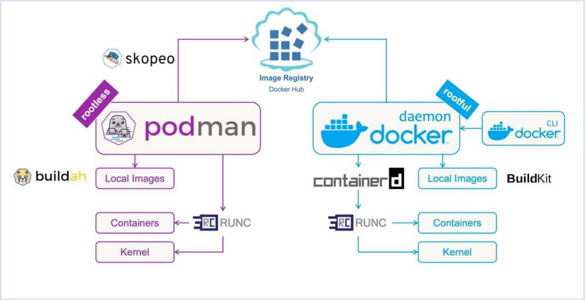

# CA05 - Containers

## Part 1

### Docker

To create a custom container with Docker, we need to first create it's image. For that, we create a file called `Dockerfile`.

A Dockerfile has, usually, the following structure:

```Dockerfile

FROM [image_name]               # Base image to base our image on

COPY [host_src] [cont_dest]     # Copy files from the host to the image

RUN [command]                   # Execute shell commands (package updates, builds, etc...)

WORKDIR [dirname]               # Execute all following RUN commands inside this directory

EXPOSE [port_number]            # Number of the port the application exposes

CMD [command]                   # The command to execute on container start

```

After writing the Dockerfile, the image has to be built, that can be done with `docker build`.

        docker build image_name:tag .

If the tag name is not provided, it get's the name `latest` for the tag.

After the image build, it can be started with the `docker run` command.

        docker run image_name:tag

Docker should now create and start a new container, with an automaticaly generated name, with the custom image.


To push the image to DockerHub, first login using the `docker login` command and use `docker push` to push the image.

        docker push username/image_name:tag

### Chat application

In the V1 image, the application is built inside the Dockerfile itself.
```Dockerfile
# syntax=docker/dockerfile:1
FROM alpine:latest

# Install app dependencies
RUN apk update && apk add git curl vim gradle maven openjdk21 

# Clone repository (replace token with a placeholder for security)
RUN git clone https://[github-token]@github.com/JoaoVeiga-afk/cogsi2425-1201082-1211106-1240159.git 

EXPOSE 59001

# Set the working directory
WORKDIR /cogsi2425-1201082-1211106-1240159/Ca02/gradle_basic_demo

# Grant execute permissions for Gradle wrapper
RUN chmod +x gradlew 

# Build the server
RUN ./gradlew build

# Run the server
CMD ["./gradlew", "runServer"]
```

While the V2 image copies the already built application instead of building it in the Dockerfile.
```Dockerfile
# syntax=docker/dockerfile:1
FROM alpine:latest


RUN apk update && apk add openjdk21

# Copy jar
COPY basic_demo-0.1.0.jar /

EXPOSE 59001

CMD ["java", "-cp" , "basic_demo-0.1.0.jar" , "basic_demo.ChatServerApp" , "59001"]
```

This change, v1 to v2, reduces the diskspace used by the image, as seen in the history of both:
```txt
$ docker image ls
REPOSITORY               TAG       IMAGE ID       CREATED        SIZE
ruifpb/resting-chat      v1        c9950b45b475   5 days ago     690MB
ruifpb/resting-chat      v2        01f9ddd1c337   5 days ago     325MB

$ docker image history ruifpb/resting-chat:v1
IMAGE          CREATED        CREATED BY                                      SIZE      COMMENT
c9950b45b475   5 days ago     CMD ["./gradlew" "runServer"]                   0B        buildkit.dockerfile.v0
<missing>      5 days ago     RUN /bin/sh -c ./gradlew build # buildkit       166MB     buildkit.dockerfile.v0
<missing>      5 days ago     RUN /bin/sh -c chmod +x gradlew # buildkit      8.76kB    buildkit.dockerfile.v0
<missing>      5 days ago     WORKDIR /cogsi2425-1201082-1211106-1240159/C…   0B        buildkit.dockerfile.v0
<missing>      5 days ago     EXPOSE map[59001/tcp:{}]                        0B        buildkit.dockerfile.v0
<missing>      5 days ago     RUN /bin/sh -c git clone https://github_pat_…   1.36MB    buildkit.dockerfile.v0
<missing>      5 days ago     RUN /bin/sh -c apk update && apk add git cur…   515MB     buildkit.dockerfile.v0
<missing>      2 months ago   CMD ["/bin/sh"]                                 0B        buildkit.dockerfile.v0
<missing>      2 months ago   ADD alpine-minirootfs-3.20.3-x86_64.tar.gz /…   7.8MB     buildkit.dockerfile.v0

$ docker image history ruifpb/resting-chat:v2
IMAGE          CREATED        CREATED BY                                      SIZE      COMMENT
01f9ddd1c337   5 days ago     CMD ["java" "-cp" "basic_demo-0.1.0.jar" "ba…   0B        buildkit.dockerfile.v0
<missing>      5 days ago     EXPOSE map[59001/tcp:{}]                        0B        buildkit.dockerfile.v0
<missing>      5 days ago     COPY basic_demo-0.1.0.jar / # buildkit          1.88MB    buildkit.dockerfile.v0
<missing>      5 days ago     RUN /bin/sh -c apk update && apk add openjdk…   315MB     buildkit.dockerfile.v0
<missing>      2 months ago   CMD ["/bin/sh"]                                 0B        buildkit.dockerfile.v0
<missing>      2 months ago   ADD alpine-minirootfs-3.20.3-x86_64.tar.gz /…   7.8MB     buildkit.dockerfile.v0
```

As seen in the history for both versions, the largest layer is the one where dependencies are installed.
The difference in size between both versions is due to the larger number of dependencies on the v1, and the build process generating a lot of files.

### Spring application

For the Spring application, the Dockerimages for v1 and v2 work in the same way.

V1 builds the application in the docker file:
```Dockerfile
# syntax=docker/dockerfile:1

# Define the base image as Alpine Linux, a lightweight distribution
FROM alpine:latest

# Install necessary dependencies: OpenJDK 21, Git, Curl, and Unzip
RUN apk update && \
    apk add --no-cache openjdk21 git curl unzip 

# Clone the GitHub repository (replace the token with a placeholder for security purposes)
RUN git clone https://[token]@github.com/JoaoVeiga-afk/cogsi2425-1201082-1211106-1240159.git /repo 

# Expose port 8080, which is commonly used by Spring Boot applications
EXPOSE 8080

# Set the working directory to the cloned repository's folder
WORKDIR /repo/Ca02/new-tut-rest/

# Remove the existing application properties file (this might be necessary for your setup)
RUN rm app/src/main/resources/application.properties 

# Make the gradlew script executable
RUN chmod +x gradlew 

# Build the server using the Gradle Wrapper (gradlew)
RUN ./gradlew build

# Define the command to run the server using the Gradle BootRun task
CMD ["./gradlew", "bootRun"]
```

While V2 copies the already built application to the image:
```Dockerfile
# syntax=docker/dockerfile:1

# Define the base image as Alpine Linux, a lightweight distribution
FROM alpine:latest

RUN apk update && \
    apk add --no-cache openjdk21

COPY app.jar app.jar

EXPOSE 8080

CMD [ "java", "-jar", "app.jar" ]
```

In this application, this change, from v1 to v2, also reduces the diskspace used by the image.
```txt
$ docker image ls
REPOSITORY               TAG       IMAGE ID       CREATED        SIZE
ruifpb/spring-employer   v1        feab1720f1e0   6 days ago     814MB
ruifpb/spring-employer   v2        a8124262f5eb   5 days ago     369MB

$ docker image history ruifpb/spring-employer:v1
IMAGE          CREATED        CREATED BY                                      SIZE      COMMENT
feab1720f1e0   6 days ago     CMD ["./gradlew" "bootRun"]                     0B        buildkit.dockerfile.v0
<missing>      6 days ago     RUN /bin/sh -c ./gradlew build # buildkit       478MB     buildkit.dockerfile.v0
<missing>      6 days ago     RUN /bin/sh -c chmod +x gradlew # buildkit      0B        buildkit.dockerfile.v0
<missing>      6 days ago     RUN /bin/sh -c rm app/src/main/resources/app…   0B        buildkit.dockerfile.v0
<missing>      6 days ago     WORKDIR /repo/Ca02/new-tut-rest/                0B        buildkit.dockerfile.v0
<missing>      6 days ago     EXPOSE map[8080/tcp:{}]                         0B        buildkit.dockerfile.v0
<missing>      6 days ago     RUN /bin/sh -c git clone https://github_pat_…   1.36MB    buildkit.dockerfile.v0
<missing>      6 days ago     RUN /bin/sh -c apk update &&     apk add --n…   327MB     buildkit.dockerfile.v0
<missing>      2 months ago   CMD ["/bin/sh"]                                 0B        buildkit.dockerfile.v0
<missing>      2 months ago   ADD alpine-minirootfs-3.20.3-x86_64.tar.gz /…   7.8MB     buildkit.dockerfile.v0

$ docker image history ruifpb/spring-employer:v2
IMAGE          CREATED        CREATED BY                                      SIZE      COMMENT
a8124262f5eb   5 days ago     CMD ["java" "-jar" "app.jar"]                   0B        buildkit.dockerfile.v0
<missing>      5 days ago     EXPOSE map[8080/tcp:{}]                         0B        buildkit.dockerfile.v0
<missing>      5 days ago     COPY app.jar app.jar # buildkit                 46MB      buildkit.dockerfile.v0
<missing>      5 days ago     RUN /bin/sh -c apk update &&     apk add --n…   315MB     buildkit.dockerfile.v0
<missing>      2 months ago   CMD ["/bin/sh"]                                 0B        buildkit.dockerfile.v0
<missing>      2 months ago   ADD alpine-minirootfs-3.20.3-x86_64.tar.gz /…   7.8MB     buildkit.dockerfile.v0
```

The dependency instalation layer is still a large portion of the image size, but now the build stage uses even more diskspace than the Chat application.


### Optimization with Multistage Builds:

A multistage Dockerfile divides the build process into several stages, with each stage having a specific purpose. The first stage can be used to build the application, and the second stage copies only the necessary files to the production environment.


```Dockerfile
# syntax=docker/dockerfile:1

# Stage 1: Build stage
FROM alpine:latest AS build

# Install build dependencies
RUN apk update && \
    apk add --no-cache openjdk21 git curl unzip

# Clone the repository
RUN git clone https://github_pat_token@github.com/JoaoVeiga-afk/cogsi2425-1201082-1211106-1240159.git /repo

# Set working directory
WORKDIR /repo/Ca02/new-tut-rest/

# Remove existing application properties
RUN rm app/src/main/resources/application.properties

# Make gradlew executable
RUN chmod +x gradlew

# Build the application
RUN ./gradlew build
###############################################################
# Stage 2: Runtime stage
FROM eclipse-temurin:21-jre-alpine

# Copy the built artifact from the build stage
COPY --from=build /repo/Ca02/new-tut-rest/app/build/libs/*.jar /app/app.jar

# Expose the application port
EXPOSE 8080

# Set the working directory
WORKDIR /app

# Run the application
CMD ["java", "-jar", "app.jar"]
```

- Stage 1: The first stage is used to build the application. The Dockerfile does the following:
  The first stage is used to build the application. The Dockerfile installs the dependencies, clones the repository and builds the application. At the end of this stage, we have an image containing the entire development environment, including the source code, dependencies and temporary files needed to compile the application.


- Stage 2: The second stage is where the application will actually run. The final image uses Eclipse Temurin, which contains only the Java Runtime Environment (JRE), making the image lighter and more suitable for running the application. Only the built artifact (app.jar) is copied from the build stage. None of the build files, such as the source code or Gradle dependencies, are transferred to the final image. Finally, the application is run using the java -jar app.jar command.


Now, when using multistage builds, we can compare the impact on the size of the final image. Here, the build takes place in a separate container, and the final image contains only the built artifact. Without the source code and build dependencies, the final image is much more compact.
To illustrate this, we compared the V1 version of the Spring application (without multistage) with the V1Multistage version (with multistage).

#### **Image History without Multistage (V1)**

```bash
docker image history ruifpb/spring-employer:V1
```

```text
IMAGE          CREATED          CREATED BY                                      SIZE      COMMENT
0d092bd19098   53 seconds ago   CMD ["./gradlew" "bootRun"]                     0B        buildkit.dockerfile.v0
<missing>      53 seconds ago   RUN /bin/sh -c ./gradlew build # buildkit       491MB     buildkit.dockerfile.v0
<missing>      2 minutes ago    RUN /bin/sh -c chmod +x gradlew # buildkit      4.1kB     buildkit.dockerfile.v0
```
The image is 491MB due to the inclusion of dependencies and the build process (RUN command /bin/sh -c ./gradlew build).

#### **Image History with Multistage (V1Multistage)**
In the V1Multistage version, the build process takes place in a separate stage, and only the final artifact (the JAR) is copied to the production image. The command below shows the history of the multistage image:

```bash
docker image history ruifpb/spring-employer:V1Multistage
```

```text
IMAGE          CREATED          CREATED BY                                      SIZE      COMMENT
85115815baad   38 seconds ago   CMD ["java" "-jar" "app.jar"]                   0B        buildkit.dockerfile.v0
<missing>      38 seconds ago   WORKDIR /app                                    4.1kB     buildkit.dockerfile.v0
<missing>      38 seconds ago   EXPOSE map[8080/tcp:{}]                         0B        buildkit.dockerfile.v0
<missing>      38 seconds ago   COPY /repo/Ca02/new-tut-rest/app/build/libs/…   46MB      buildkit.dockerfile.v0
```
The image is 46MB, which is significantly smaller than the V1 version, since it only contains the artifact generated by the build process (the JAR file), without including the source code or build dependencies.


### Monitoring
Here are some of the most commonly used tools and commands for monitoring container resource consumption:

The `docker stats` command displays the real-time resource consumption of running containers. It provides information such as CPU usage, memory, disk I/O, network and more.

#### Example of use:

```bash
docker stats
```
Expected Output:

```text
CONTAINER ID   NAME      CPU %     MEM USAGE / LIMIT     MEM %     NET I/O         BLOCK I/O   PIDS
e34ce04defff   chat      0.07%     77.72MiB / 15.22GiB   0.50%     6.43kB / 462B   0B / 0B     19
```

To monitor the resource consumption of a specific container, you can pass the container ID or name to the `docker stats` command.

```bash
docker stats e34ce04defff
```

As well as monitoring resources, you can set limits on resource usage, ensuring that no container consumes more than expected. This can be done during container execution with the --memory and --cpus options.

```bash
docker run --rm --name chat --memory="512m" --cpus="1.0" ruifpb/chat:V2Multistage
```

## Part 2

### Use Docker Compose to create two containers

Docker Compose makes it easy to configure applications with multiple containers, allowing you to define the containers, their configurations and the relationships between them in a single YAML file.

In the example below, we have configured two containers: one for the web application and the other for the H2 database.
```Docker-Compose
services:
  ##Container WEB##
  web:
      image: openjdk:21
      ports:
            - "8080:8080"  # Exposing port 8080 for the Spring Boot application
      hostname: web
      container_name: web
      environment:
        - H2_USER=spring-app  # Defining the user for the H2 database
        - H2_PASS=pass-spring-app # Password for the H2 database
        - H2_URL= jdbc:h2:tcp://db:1521/database/new-tut-rest # H2 database connection URL
      volumes:
            - .:/app # Mounting the current directory to /app inside the container
      working_dir: /app # Setting the working directory inside the container
      command: ["java", "-jar", "app.jar"] # Command to run the Java application

  ##Container db##
  db:
    image: oscarfonts/h2:2.1.214
    ports:
      - "81:81"  # Exposing port to access H2 Console
      - "1521:1521"  # Exposing port for H2 TCP server
    hostname: db
    container_name: db
    environment:
        - H2_OPTIONS=-ifNotExists -web -webAllowOthers -tcp -tcpAllowOthers -baseDir /data # H2 configuration to allow web and TCP access
```

- Web Container Details:
  - Uses OpenJDK 21 as base image
  - Exposes port 8080 for the Spring Boot application
  - Mounts the current directory to /app in the container
  - Runs a Java application from the JAR file
  - Configures H2 database connection environment variables

- Database Container Details:
  - Uses H2 database image version 2.1.214
  - Exposes port 81 for H2 Console access
  - Exposes port 1521 for H2 TCP server
  - Configures H2 database with web console and TCP server enabled

Using Docker Compose to manage multi-container applications allows for a highly customizable and portable setup. 
In this case, Docker Compose configures both the Spring Boot application and the H2 database container, enabling communication between the two services. 
This approach helps simplify deployment and ensures that both containers are configured and run in a consistent environment, making it easier to work with applications that require multiple services.


### Health Checks to test the network between web and db services
Health checks are essential in Docker Compose to ensure that the containers are running properly and can communicate with each other. By defining health checks, we can verify that both the web application and the database service are functional before attempting to access them.

In this case, we have added health checks for both the web and db services. These checks ensure that the web container can successfully reach the database and that the database service itself is functioning properly.

```Docker-Compose
services:
  web:
    image: openjdk:21
    healthcheck:
      test: |
      ping -c 1 db && \
      curl -f http://localhost:8080/employees && \
      curl -f http://db:1521
      interval: 15s  
      timeout: 30s  
      retries: 3  
      start_period: 1m 
    depends_on:
    - db  
```
In the web container, the health check does the following:
- Ping the Database: It sends a ping request to the db container to ensure that the container is reachable via the network.
- Check Web Service: It makes an HTTP request to the Spring Boot application (localhost:8080/employees) to ensure the web service is up and running.
- Check Database Connection: It attempts to connect to the H2 database on port 1521, ensuring that the database service is available.
- These checks are executed every 15 seconds, with a 30-second timeout for each attempt. If a health check fails, it retries up to three times. The start_period ensures the health check doesn’t start until the service has had time to initialize.

In the database container, the health check:
- Checks H2 Web Console: It sends an HTTP request to localhost:81, where the H2 Web Console is exposed. If the service is running and the web console is accessible, the health check will succeed

To check whether all the health checks have passed and that your containers are running correctly, you can use the docker ps command, which shows the status of all running containers, including their health status.

```bash
docker ps
```
The output:
```text
CONTAINER ID   IMAGE                       STATUS                    PORTS                                        NAMES
45eec74f320c   openjdk:21-buster         Up 37 minutes (healthy)   0.0.0.0:8080->8080/tcp                       web
6b68f7dc0485   oscarfonts/h2:2.1.214     Up 37 minutes (healthy)   0.0.0.0:81->81/tcp, 0.0.0.0:1521->1521/tcp   db
```


### Persist the database file
In Docker, containers are ephemeral, meaning that any data stored inside them is lost when the container is stopped, removed, or recreated. To ensure that data is not lost, it's essential to persist it outside the container.

In our case, we're using Docker volumes to persist the H2 database file. A Docker volume is a managed directory that exists outside of the container's file system, ensuring that data persists across container restarts or removals.

Below is the configuration used in the docker-compose.yml file to persist the database data:
```Docker-Compose
services:
  db:
    image: oscarfonts/h2:2.1.214
     volumes:
      - ./data:/data
```

./data:/data: This mounts the data directory from the host machine to the /data directory inside the container. 

This ensures the database files are persisted outside the container, allowing the data to remain intact even if the container is stopped or recreated.


### Environment variables to configure services
Environment variables in Docker Compose allow you to easily configure and customize the services running in your containers. 
They are commonly used to pass configuration values such as database connection details, usernames, passwords, and other environment-specific settings.

```Docker-Compose
services:
  web:
      image: openjdk:21
      environment:
        - H2_USER=spring-app
        - H2_PASS=pass-spring-app
        - H2_URL= jdbc:h2:tcp://db:1521/database/new-tut-rest
```
In the above Docker Compose configuration, we define three environment variables: H2_USER, H2_PASS, and H2_URL. 
These variables hold the user credentials and the connection URL for the H2 database.

```diff
> spring.datasource.url=jdbc:h2:tcp://db:1521/database/new-tut-rest
> spring.datasource.url=${H2_URL}
> spring.datasource.username=${H2_USER}
> spring.datasource.password=${H2_PASS}
```
In the Spring application's application.properties file, these environment variables are used to set the database connection properties. 
The ${H2_URL}, ${H2_USER}, and ${H2_PASS} refer to the values defined in the Docker Compose file.

## Alternative solution - Analyses

### Podman
Podman is a container management tool designed to be a drop-in replacement for Docker. It's daemonless, meaning it doesn't require a persistent background service to run containers, and it can be run by non-root users, providing a higher level of security.



#### Comparison to Docker:

- Daemonless Architecture: Unlike Docker, which requires a central daemon to manage containers, Podman runs as a set of individual processes. This eliminates the need for a long-running background service, which improves security.
- Compatibility with Docker Commands: Podman is designed to be compatible with Docker, allowing the same commands (podman run, podman build, etc.). This makes it relatively easy to transition from Docker to Podman.
- Rootless Containers: Podman allows for rootless containers, meaning that containers can be run without requiring elevated privileges. This makes Podman more secure out-of-the-box compared to Docker, which typically runs as a root process.
- Image Management: Podman uses container images in the same way Docker does, but without needing a centralized registry or daemon. It can work with Docker Hub or other registries, making image management straightforward.
- Pod Management: Podman has built-in support for managing groups of containers, or "pods," similar to Kubernetes pods. This is a key advantage over Docker, which doesn’t have native pod management.


### LXC
LXC provides a userspace interface for the Linux kernel's container capabilities, allowing users to create and manage containers that are closer to virtual machines than the lightweight Docker containers. It’s a more full-featured, system-level containerization tool.

#### Comparison to Docker:
- System Containers vs. Application Containers: LXC provides system containers, which include a full operating system environment. In contrast, Docker is typically used for application containers, which are lighter-weight and only include the necessary dependencies for running a specific application.
- Isolation: LXC offers more complete system isolation compared to Docker. It provides a closer approximation to virtual machines, with its own init system and network stack, making it suitable for running entire operating systems.
- Performance: Since LXC containers simulate a full OS, they might require more resources than Docker containers, which are more lightweight and focused on application isolation.
- Networking and Storage: LXC offers more control over networking and storage configurations, which may be more complex than Docker’s simpler configuration.

### LXD

LXD is a system container manager built on top of LXC, which enhances the LXC experience by providing a REST API, better management tools, and easier configuration. LXD is designed to be a more user-friendly way to manage LXC containers and is ideal for managing virtualized environments.

#### Comparison to Docker:
- Full System Containers: Like LXC, LXD is focused on full system containers. These are more akin to lightweight virtual machines than Docker’s application containers.
- REST API: LXD offers a REST API that can be used for managing containers, making it easier to integrate into automation workflows compared to Docker’s CLI tools.
- Storage and Networking: LXD provides advanced storage backends (e.g., ZFS, btrfs) and networking features, making it suitable for managing containers in a more complex infrastructure setup.


### Resuming Table
| **Feature**                        | **Docker**                            | **Podman**                                | **LXC**                                   | **LXD**                                   |
|------------------------------------|---------------------------------------|-------------------------------------------|-------------------------------------------|-------------------------------------------|
| **Container Type**                 | Application Containers                | Application Containers                    | System Containers                         | System Containers                         |
| **Daemonless**                     | No (Requires Docker Daemon)           | Yes                                       | No (Requires LXC Daemon)                  | No (Requires LXC Daemon)                  |
| **Rootless Containers**            | No (Requires root access)             | Yes                                       | No (Typically requires root access)       | No (Typically requires root access)       |
| **System Isolation**               | Application-level isolation           | Application-level isolation               | System-level isolation (closer to VMs)    | System-level isolation (full OS environment) |
| **Compatibility with Docker Commands** | Yes                                  | Yes (podman commands mirror docker)       | No                                        | No                                        |
| **Networking and Storage Flexibility** | Basic (via Docker Compose, networks, volumes) | Basic (similar to Docker, plus pod management) | Advanced (network and storage management) | Advanced (network, storage, and flexible configurations) |
| **Use Case**                        | Managing and deploying applications   | Application containerization without a daemon, ideal for rootless environments | Full OS-level containerization, ideal for system-level workloads | System container management with a REST API and easy integration into existing infrastructure |

### Implementation : LXD
We implemented LXD instead of Podman because, although Podman is an alternative to Docker, its functionality is similar to Docker's in many respects. The choice of LXD was based on it being the only viable alternative to Docker, rather than opting for LXC directly. While LXC is an excellent tool for low-level containers, LXD offers an additional layer of abstraction and management, making it easier to create and manage containers more simply and efficiently.

Due to the way LXD works, there is no way to replicate the docker-compose's one file, multiple containers workflow. We implemented only one container (Spring), running our App.

LXD is maintained and distributed by Canonical, so the best way to use it is inside a Ubuntu machine/server.

#### Instalation

To install LXD, we ran the following commands:
```bash
sudo snap install lxd lxd-imagebuilder
sudo usermod -aG lxd "$USER"    # Needed if not added automatically
lxd init --minimal              # Settings can be tuned, but the default loaded by minimal is enough.
```

#### Building the image
Similarly to Docker, when building a custom image, it needs to be defined on a file. LXD-ImageBuilder uses YAML files to define it's images.
Unfortunatly, the files are much more complex than Dockerfile/ContainerFile or even compose.yaml files.

For our image, we used the base ubuntu template provided by [lxd-imagebuilder examples](https://github.com/canonical/lxd-imagebuilder/blob/main/doc/examples/ubuntu.yaml).

The images have 7 main sections:

  - image : Defines information for the image, such as: Distribution, Architecture and Release
  - source : Defines main package source, keys and downloader
  - targets : Defines configuration
  - files : Generate and modify files
  - packages : Install packages from the package manager
  - action : Defines scripts to run after certain sections of the build process
  - mappings : Defines different terms for architecture definition

For our spring app, we modified the image section to better specify our usecase:
```yaml
image:
  name: spring-app
  distribution: spring-employer
  release: jammy
  description: |-
    Spring Employer APP
  architecture: x86_64

simplestream:
  distro_name: Ubuntu
  release_aliases:
    focal: 20.04
    jammy: 22.04
    noble: 24.04
```
The simplestream section maps release names to versions.

We kept the same source definition as the main image. This just creates the basic file system for the chosen distribution.
```yaml
source:
  downloader: debootstrap
  same_as: gutsy
  url: http://archive.ubuntu.com/ubuntu
  keyserver: keyserver.ubuntu.com
  keys:
  - 0x790BC7277767219C42C86F933B4FE6ACC0B21F32
  - 0xf6ecb3762474eda9d21b7022871920d1991bc93c
```

We also did not change the targets section.

```yaml
targets:
  lxc:
    create_message: |-
      You just created an {{ image.description }} container.

      To enable SSH, run: apt install openssh-server
      No default root or user password are set by LXC.
    config:
    - type: all
      before: 5
      content: |-
        lxc.include = LXC_TEMPLATE_CONFIG/ubuntu.common.conf

    - type: user
      before: 5
      content: |-
        lxc.include = LXC_TEMPLATE_CONFIG/ubuntu.userns.conf

    - type: all
      after: 4
      content: |-
        lxc.include = LXC_TEMPLATE_CONFIG/common.conf

    - type: user
      after: 4
      content: |-
        lxc.include = LXC_TEMPLATE_CONFIG/userns.conf

    - type: all
      content: |-
        lxc.arch = {{ image.architecture_personality }}
```

In the files section, we added settings to copy the JAR file for the app and to create the service to run it.
```yaml
files:
- path: /etc/hostname
  generator: hostname

- path: /etc/hosts
  generator: hosts

- path: /etc/resolvconf/resolv.conf.d/original
  generator: remove

- path: /etc/resolvconf/resolv.conf.d/tail
  generator: remove

- path: /etc/machine-id
  generator: dump

- path: /etc/user/profile
  generator: copy
  source: /etc/profile

- path: /var/lib/dbus/machine-id
  generator: remove

- path: /etc/netplan/10-lxc.yaml
  generator: dump
  content: |-
    network:
      version: 2
      ethernets:
        eth0:
          dhcp4: true
          dhcp-identifier: mac
  releases:
  - focal
  - jammy
  types:
  - container
  variants:
  - default

- path: /etc/sudoers.d/90-lxd
  generator: dump
  mode: 0440
  content: |-
    # User rules for ubuntu
    ubuntu ALL=(ALL) NOPASSWD:ALL
  variants:
    - default

- path: /root/app.jar
  generator: copy
  source: app.jar

- path: /etc/systemd/system/spring.service
  generator: dump
  content: |-
    [Unit]
    Description=Spring service
    After=network.target
    StartLimitIntervalSec=0

    [Service]
    Restart=always
    RestartSec=1
    ExecStart=java -jar /root/app.jar

    [Install]
    WantedBy=multi-user.target
```

In the packages section, we added the dependencies we needed (Java 21 Runtime)
```yaml
packages:
  manager: apt
  update: true
  cleanup: true
  sets:
  - packages:
    - fuse
    - language-pack-en
    - openssh-client
    - vim
    action: install

  - packages:
    - openjdk-21-jre-headless
    action: install

  repositories:
  - name: sources.list
    url: |-
      deb http://archive.ubuntu.com/ubuntu {{ image.release }} main restricted universe multiverse
      deb http://archive.ubuntu.com/ubuntu {{ image.release }}-updates main restricted universe multiverse
      deb http://security.ubuntu.com/ubuntu {{ image.release }}-security main restricted universe multiverse
    architectures:
    - amd64
    - i386
```

For the actions section, a script was added to enable the spring service after the necessary files were created.
```yaml
actions:
- trigger: post-update
  action: |-
    #!/bin/sh
    set -eux

    # Create the ubuntu user account
    getent group sudo >/dev/null 2>&1 || groupadd --system sudo
    useradd --create-home -s /bin/bash -G sudo -U ubuntu
  variants:
  - default

- trigger: post-packages
  action: |-
    #!/bin/sh
    set -eux

    # Enable systemd-networkd
    systemctl enable systemd-networkd
  releases:
  - focal
  - jammy

- trigger: post-packages
  action: |-
    #!/bin/sh
    set -eux

    # Make sure the locale is built and functional
    locale-gen en_US.UTF-8
    update-locale LANG=en_US.UTF-8

    # Cleanup underlying /run
    mount -o bind / /mnt
    rm -rf /mnt/run/*
    umount /mnt

    # Cleanup temporary shadow paths
    rm /etc/*-

- trigger: post-files
  action: |-
    #!/bin/sh
    systemctl enable spring
```

The mappings section, was kept the same.
```yaml
mappings:
  architecture_map: debian
```

To create the image, we run `sudo lxd-imagebuilder build-lxd spring.yaml`. (Yes, it needs sudo) 

After 5-10 minutes (or even 20 if the machine is slow), we import the image with `lxc image import lxd.tar.xz rootfs.squashfs --alias spring` and `lxc image list` will give the following output:


```txt
+--------+--------------+--------+---------------------------------------------+--------------+-----------+-----------+------------------------------+
| ALIAS  | FINGERPRINT  | PUBLIC |                 DESCRIPTION                 | ARCHITECTURE |   TYPE    |   SIZE    |         UPLOAD DATE          |
+--------+--------------+--------+---------------------------------------------+--------------+-----------+-----------+------------------------------+
| spring | fdbe2835a020 | no     | Spring Employer APP                         | x86_64       | CONTAINER | 212.10MiB | Nov 24, 2024 at 8:22pm (UTC) |
+--------+--------------+--------+---------------------------------------------+--------------+-----------+-----------+------------------------------+
```

To create a container with the image, run `lxc launch spring c1`, creating a container using our image with the name c1.
The container status can be checked with `lxc list`.

```txt
+------+---------+---------------------+----------------------------------------------+-----------+-----------+
| NAME |  STATE  |        IPV4         |                     IPV6                     |   TYPE    | SNAPSHOTS |
+------+---------+---------------------+----------------------------------------------+-----------+-----------+
| c1   | RUNNING | 10.30.40.229 (eth0) | fd42:88e8:c0bd:b50:216:3eff:fe61:e477 (eth0) | CONTAINER | 0         |
+------+---------+---------------------+----------------------------------------------+-----------+-----------+
```

It is possible to define a static ip for the containers, setting a IP for a specific name, but we kept DHCP assignment.

To check if the app was running, we tryed to create a new employee in the system:
```txt
$ curl --header 'Content-Type: application/json' --data '{"name": "Ben Dover"}' 10.30.40.229:8080/employees
{"id":1,"firstName":"Ben","lastName":"Dover","role":null,"jobYears":null,"emailAddress":null,"name":"Ben Dover","_links":{"self":{"href":"http://10.30.40.229:8080/employees/1"},"employees":{"href":"http://10.30.40.229:8080/employees"}}}
```

The server returned a successfull response, and the GET request returns the data for the employees.

We did not implement a Docker-compose alternative, because it would require a C or Python script to be created with badly documented APIs. 

### Conclusion
In conclusion, although LXD offers a powerful approach to managing containers on Linux, Docker is significantly simpler and more straightforward for cases like ours. Docker's configuration is more intuitive, with fewer steps and less need for manual customization, making it the more practical and efficient choice for most development and testing scenarios. The additional complexity of LXD does not outweigh the benefits for this type of use, making Docker a more suitable and less labor-intensive solution.
