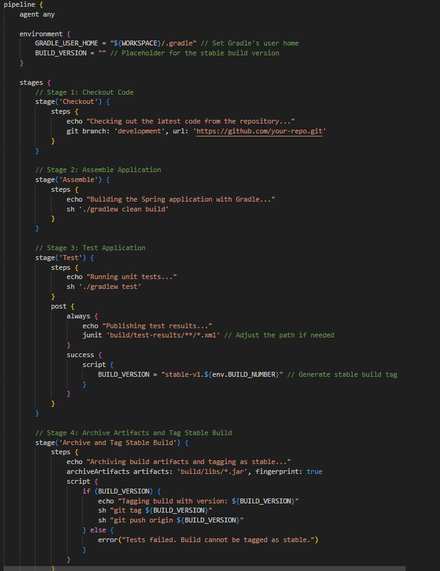

# CI/CD Pipelines with Jenkins

## Ojectives

- The objective of this project is to design and implement Continuous Integration (CI) and Continuous Deployment (CD) pipelines using Jenkins to automate the building, testing, and deployment of a RESTful application developed with Spring.This includes:

1. CI/CD Pipeline with Jenkins
2. Automated VM-Based Deployment
3. Blue-Green Deployment Strategy
4. Rollback Mechanism for Stable Versions
5. Docker Image Creation and Deployment
6. Branch-Specific Production Deployment
7. Integration of Notifications in the Pipeline
8. Automated Deployment Verification
9. Exploration of Alternative CI/CD Solutions

### Preparations for the Project (Prerequesites)

- Before diving into the implementation of the CI/CD pipelines, it’s crucial to set up the foundational tools and configurations required for the project. These preparations ensure a smooth workflow and prevent potential roadblocks during development. The preparation phase involves installing and configuring essential tools like Jenkins, Vagrant, Ansible, and Docker, as well as organizing the project repository and testing the basic setup.

- This phase is not only about getting the tools ready but also about aligning the project environment with the goals of the assignment. By investing time in proper preparation, the subsequent implementation of tasks becomes efficient and well-structured.

- The following steps outline the key preparations made for this project, providing context for the technical setup that supports the CI/CD pipelines. Some steps were done from past projects that we have developed, but you still have a context to look at if you are just beginning:

1. Environment Setup

- Install Jenkins on your host machine
- Download and install Vagrant to automate VM creation.
- Set up Ansible on your host machine for configuration management and provisioning.
- Ensure Docker is installed and working correctly for Part 2 of the project.

2. Repository Configuration

- Create a dedicated folder for the assignment in your private Git repository.

3. Application Setup

- Add the provided Building REST Services with Spring project to your repository:
- Install Gradle if it’s not already available on your system.

4. Credential Management

- Set up a Docker Hub account and obtain credentials for pushing Docker images in Part 2.
- Configure Jenkins with any required credentials.
- Docker Hub credentials.
- Secure credentials for Ansible playbooks if necessary.

5. Testing Basic Configurations

- Test Vagrant and Ansible by writing a small test Vagrantfile and Ansible playbook to confirm that VMs can be created and configured.
- Test Jenkins by running a sample pipeline in Jenkins to ensure it can execute stages like checkout, build, and test.

### Part 1: Virtual Machines and Jenkins Pipeline

- This tutorial provides a step-by-step guide to implementing Part 1 of CA6, which extends the tasks completed in previous assignments (CA3, CA4, and CA5). These earlier projects covered foundational work in virtualization with Vagrant, provisioning and configuration with Ansible, and containerization with Docker. Leveraging these prior experiences, this assignment focuses on creating a CI/CD pipeline using Jenkins to deploy a Spring REST application to a blue-green virtualized environment.

#### Virtual Machines

1. Blue-Green Environment Setup

Using insights from CA3, create two virtual machines (blue and green) with Vagrant:

2. Unified Playbook for ansible

- For simplicity and alignment with the task's goals, I recommend consolidating the playbooks into one. This approach aligns with the unified environment created for the app-db server and simplifies management for this task.

- So we did that and take this as an example to guide you:

Also make sure that you define you VM to be targeted by ansible, example:

`bash
   [application-vm]
    192.168.x.x
    `

3. Run the Playbook:

- To run the playbook that you have just created you will use the command:

`bash
    ansible-playbook -i inventory provision.yml
    `

#### Jenkins Pipeline

**Pipeline Stages Overview**

1. Checkout: Fetch the latest code from the repository.
2. Assemble: Compile the Spring application using Gradle and produce the JAR artifact.
3. Test: Execute unit tests and publish the results in Jenkins.
4. Archive: Store the compiled artifacts for future use.
5. Deploy to Production?: Add a manual approval stage for deployment to production.
6. Deploy: Use Ansible to deploy and start the application on the production environment.

**Jenkinsfile Implementation**

1. The Jenkinsfile effectively meets the requirements outlined in the task. It includes all the necessary stages, such as checking out the code, building the application, running tests, archiving artifacts, and deploying the application to production with a manual approval step. The addition of dynamic tagging ensures builds are labeled consistently (e.g., stable-v1.X), aligning with best practices for CI/CD pipelines.

The structure is clear and modular, making it easy to maintain and extend if additional stages or checks are needed. Overall, the pipeline demonstrates a well-rounded and robust approach to CI/CD, adhering to the requirements and offering a strong foundation for future enhancements.

Notifications are implemented as console messages, which work for basic setups. However, integrating with external tools like Slack, Microsoft Teams, or email could enhance communication, particularly for distributed teams. Deployment verification is handled via a curl command to validate that the application is live and functioning, providing an essential safety check after deployment.

> ⚠️ **Important:** This is a critical note.

**About Environment Variables in Jenkins**

In this Jenkinsfile, we use environment variables like ${BUILD_VERSION} to store and manage values dynamically during the pipeline execution. These variables make it easier to:

1. Pass data between stages.
2. Avoid hardcoding values, ensuring flexibility and maintainability.
3. Dynamically assign build-specific metadata, such as stable build tags.

For example:

"${BUILD_VERSION}" holds the tag name for stable builds (stable-v1.X), which is assigned only after the build passes all tests.

To learn more about how environment variables work in Jenkins and how to define or use them, refer to the official Jenkins documentation: [Jenkins Environment Variables](https://www.jenkins.io/doc/pipeline/tour/environment/).

---

2. Rollback

- In any CI/CD pipeline, having a robust rollback mechanism is essential for maintaining application stability and minimizing downtime. The rollback process ensures that in case of a failed deployment or unforeseen issues in the production environment, the application can revert to a previously stable version.

- The rollback playbook is designed to automate the process of reverting the application on the green VM to a previously stable version. This is critical in scenarios where a new deployment fails or introduces issues in the production environment.

-The playbook performs the following tasks:

1. Artifact Retrieval: Connects to Jenkins using its API to download a stable artifact tagged as stable-vX.X.
2. Stop Current Application: Ensures the currently running application is stopped and all resources are released.
3. Deploy Stable Version: Replaces the running application with the stable artifact and restarts the service.
4. Health Check: Verifies the application is functioning correctly by performing an HTTP request to confirm availability and expected behavior.

- This playbook ensures minimal downtime and quick recovery in case of failures, allowing you to maintain system stability while addressing deployment issues. It integrates seamlessly into the Jenkins pipeline, providing an automated and reliable fallback mechanism.

**Integrating the Playbook with Jenkins**

- To integrate this playbook into your Jenkins pipeline via Jenkinsfile:

- The rollback step in Jenkins provides an automated way to trigger the rollback playbook when needed. This step is integrated into the pipeline to ensure a smooth and efficient recovery process in case of deployment failures or unexpected issues in production.

**How It Works**

The rollback step retrieves the version to roll back to, either automatically from the pipeline environment or manually through a prompt in Jenkins.
It invokes the Ansible rollback playbook, which fetches the stable artifact from Jenkins, stops the currently running application, deploys the stable version, and verifies the application’s health.

The when condition ensures the rollback step runs only under specific circumstances:

1. If a prior stage fails (e.g., deployment verification).
2. If triggered manually by the user via a Jenkins input prompt.

**Why It’s Important**

- Including the rollback step in Jenkins:

1. Adds a safety net for production environments, ensuring quick recovery in case of deployment issues.
2. Provides flexibility to manually intervene and roll back when needed.
3. Integrates seamlessly with the rest of the CI/CD pipeline, making the rollback process consistent and repeatable.

**User Guidance**

- To execute a rollback:

1. Monitor the pipeline’s progress in Jenkins.
2. If a failure occurs or rollback is required, the pipeline will prompt for a stable version to revert to (e.g., stable-v1.0).
3. Confirm the rollback, and Jenkins will handle the rest, ensuring the application is restored to a working state.

This step ensures your CI/CD pipeline is not only robust but also prepared to handle real-world scenarios where stability is paramount.

### Part 2: Pipeline with Docker and Production VM Deployment

- This section focuses on creating a Jenkins pipeline that builds a Docker image of the Gradle version of the Building REST services with Spring application, publishes it to Docker Hub, and deploys it on a production VM using Vagrant and Ansible.

#### Pipeline with Docker

- Part 2 of this project focuses on modernizing the deployment workflow by integrating Docker into the CI/CD pipeline. Docker allows the application and its database to be encapsulated in lightweight, portable containers, ensuring consistency across development, testing, and production environments. This approach minimizes dependencies on the underlying infrastructure and simplifies scaling and maintenance.

The objective is to create a pipeline that:

1. Builds Docker images for the Spring application and the H2 database.
2. Publishes these images to Docker Hub, making them easily accessible for deployment.
3. Deploys the containers on a dedicated production virtual machine.

- This part demonstrates a practical implementation of containerized CI/CD workflows, highlighting the advantages of Docker in maintaining application consistency and enhancing deployment efficiency.

- We start the criation of the pipeline with a Jenkinsfile like so:

- Benefits of the use of a Jenkinsfile:

1. Comprehensive CI/CD Workflow:

Encapsulates the entire pipeline, from code checkout to deployment, within a single file.
Ensures consistency and standardization across builds, reducing manual errors.

2. Branch Protection:

Incorporates conditional logic to restrict production deployments to commits made on the main branch.
Minimizes the risk of deploying untested or unstable code to production environments.

3. Parallel Efficiency:

Executes unit and integration tests in parallel, reducing overall pipeline runtime.
Demonstrates efficient use of resources, improving scalability in larger projects.

4. Security and Traceability:

Integrates with Jenkins credentials for secure Docker Hub logins, avoiding exposure of sensitive information.
Archives important artifacts like Dockerfiles and metadata for traceability and future audits.

5. Automated Deployment Validation:

Includes health checks to verify that deployed services are functional and meet expected performance criteria.
Halts the pipeline if validation fails, ensuring a fail-fast mechanism that protects production stability.

6. Team Collaboration and Visibility:

Stores pipeline logic in the version-controlled repository, enabling easy updates and team-wide access.
Provides clear, actionable feedback during and after builds, enhancing communication among developers, testers, and operators.

7. Extensibility and Scalability:

Supports adding new stages (e.g., security scans, performance tests) without disrupting existing workflows.
Adapts seamlessly to different environments (e.g., staging, production) using conditional logic and environment variables.

#### **Docker Operations**

1. Building and Pushing the Docker Image

This screenshot demonstrates the process of building a Docker image and pushing it to Docker Hub.

`bash
     docker build -t adolfoc5501/rest_service
     docker push adolfoc5501/rest_service
     docker push adolfoc5501/rest_service
    `
This creates a Docker image tagged as adolfoc5501/rest_service.
The base image is openjdk:11-jre-slim, as defined in the Dockerfile.
Ensure you are logged in to Docker Hub (docker login) before pushing.

**Purpose**

Building: Compiles your application and packages it into a container image.
Pushing: Stores the image in Docker Hub for easy sharing and deployment.

2. Pulling and Running the Docker Image on Another Machine

The second screenshot shows how to pull the Docker image from Docker Hub and run it on a separate virtual machine.

`bash
     docker --version
     docker pull adolfoc5501/rest_service
     docker run -d -p 8080:8080 --name rest_service adolfoc5501/rest_service
    `

**Breakdown**

The version output confirms that Docker is properly installed.
Pull does download the container image to the machine.
Run starts the container with the service exposed on port 8080.

**Purpose**
Pulling: Fetches the Docker image from the repository.
Running: Starts the application in a containerized environment, accessible via http://localhost:8080.

3. Setting up Jenkins

-This screenshot shows the Jenkins setup wizard with installed plugins.

1. Install Jenkins and log in to the admin dashboard.

During the "Getting Started" process, ensure the following plugins are installed:
2. Git: For source code management.
3. Pipeline: For creating Jenkins pipelines.
4. SSH Build Agents: For secure communication between Jenkins and remote servers.
5. Credentials Binding: For managing credentials securely.

Once plugins are installed, proceed to create your pipeline.

Also we faced some issues in this step:

When adding credentials as an admin for example:

We still could not get the connection that we have pretended to our git repository in jenkins

**key Features**

1. Branch-Specific Deployment:

The Deploy stage includes a when condition to ensure that deployment to production only happens for commits pushed to the main branch:

`bash
     when {
    branch 'main'
}
    `

2. Parallel Testing:

Both unit and integration tests run in parallel to reduce pipeline runtime while demonstrating resource efficiency.

3. Docker Image Tagging:

Images are tagged using the build number (${env.BUILD_NUMBER}), ensuring traceability and a unique identifier for each build.

4. Archive Artifacts:

Archives the Dockerfile for documentation and future debugging, with fingerprinting for traceability.

5. Secure Docker Hub Integration:

Uses Jenkins credentials (dockerhub-credentials) to securely log in to Docker Hub and push the tagged image.

6. Integration with Ansible:

The Deploy stage invokes the deploy_docker_compose.yml Ansible playbook, passing the tagged Docker image as a variable for deployment.

**VargrantFile**

The Vagrantfile for Part 2 is specifically designed to create a production virtual machine optimized for Docker-based deployments. Here’s a breakdown of its features and purpose:

**Key Features**

1. Base Box:

The Vagrantfile uses the ubuntu/focal64 base box, which is lightweight, reliable, and compatible with Docker installations.

2. Resource Allocation:

The VM is configured with 2 GB of memory and 2 CPUs, providing sufficient resources to run Docker containers for both the Spring application and the H2 database.

3. Static Networking:

The VM is assigned a private IP address (192.168.57.30), ensuring consistency when accessing the application or database services during testing and deployment.

4. Docker Installation:

The Vagrantfile provisions the VM to install and configure Docker using a shell script. This ensures:
Docker is installed and started automatically.
The Docker service is enabled to persist across VM reboots.

- Also Docker containers encapsulate all the dependencies required to run the application and database. By focusing the VM on Docker, we separate the application logic from the infrastructure, ensuring a more maintainable and scalable design.

- This virtual machine is production ready and acts as a production environment where deployments are entirely containerized. It mirrors modern deployment practices used in real-world CI/CD pipelines.

**Ansible playbook**

The Ansible playbook for Part 2 is designed to streamline the deployment of the Dockerized application and database using Docker Compose. This approach encapsulates the configuration of multiple services (the Spring application and the H2 database) into a single, reusable docker-compose.yml file, ensuring consistency and simplicity in deployment.

- What This Playbook Does

1. Installs Docker and Docker Compose: Ensures that Docker and Docker Compose are installed and running on the production VM, laying the foundation for containerized deployments.

2. Manages the Deployment Lifecycle:

Stops and removes any existing containers to ensure a clean state.
Starts the application and database containers in the correct order using the configuration defined in docker-compose.yml.

3. Verifies Service Availability: Checks the statuses of both the application and database containers to ensure they are running as expected after deployment.

**Purpose**

- This playbook aligns with the goal of automating deployment while adopting modern containerization practices. It ensures that the production environment is consistently configured and ready to run the application with minimal manual intervention, reducing deployment complexity and potential errors.

With all this the playbook examples comes out like this:

- The playbook now explicitly addresses all the required tasks:

1. Ensuring Docker is installed.
2. Logging into Docker Hub.
3. Pulling the latest Docker image.
4. Stopping and removing old containers.
5. Running the new Docker container.

- It includes proper error handling for critical steps like Docker Hub login and image pulling.
  Debugging outputs help verify deployment success and make troubleshooting easier if something fails.

Of course the creation of the playbook has to be used and integrated to the workflow that we already have in the pipeline:

`bash
     stage('Deploy') {
            steps {
                ansiblePlaybook playbook: 'deploy_docker.yml', inventory: 'inventory', extraVars: [
                    docker_app_image: "${APP_IMAGE}:${DOCKER_TAG}",
                    docker_db_image: "${DB_IMAGE}:${DOCKER_TAG}"
                ]
            }
        }
    `

**Health Checks**

- Health checks are an essential component of any robust deployment process, ensuring that services are running correctly and accessible after deployment. In the context of this project, health checks validate the functionality of the Spring application and the H2 database by performing automated HTTP requests to their respective endpoints.

- Instead of this we decided that Verify that the services running inside the containers are accessible and functioning as expected was enough although the implementation of health checks with http requests and this kind of verification complement each other.

#### Notifications

**Purpose**

1. Timely Alerts: Keeps stakeholders informed about the pipeline's execution status (success, failure, or instability).
2. Accountability: Allows team members to respond promptly to pipeline issues or deployment results.
3. Integration: Extends the pipeline's visibility beyond Jenkins, enabling better collaboration and communication.

**Recommendations &|or Future Improvements**

- Slack:

1. Ideal for teams using Slack for collaboration.
2. Use the Slack Notification Plugin in Jenkins to send real-time updates to a dedicated channel.

- Email:

1. Suitable for formal notifications or teams not using chat-based tools.
2. Use the emailext plugin in Jenkins to configure detailed email notifications.

- Microsoft Teams:

1. For organizations using Teams, configure Jenkins with a webhook to send pipeline status updates directly to a Teams channel.

**What Makes This Important**

Including notifications ensures that issues are flagged as soon as they occur, enabling quick resolution and reducing potential downtime.

#### Deployment Verification

**Purpose**

1. Validate Success: Confirms that the deployment was successful and the application is operational in the production environment.
2. Fail-Fast Mechanism: If the application is not functional, the pipeline can halt further steps and notify the team.
3. Confidence in Production: Provides assurance that the deployed application meets the expected quality standards.

**Implementation Highlights**

- Use HTTP-based health checks to validate:

1. Spring Application (e.g., http://192.168.57.30:8080).
2. H2 Database Console (e.g., http://192.168.57.30:8082).

- Automate these checks in the pipeline or playbook using:

1. Ansible Tasks: Incorporate uri module or curl commands.
2. Jenkinsfile: Add a Deployment Verification stage with scripted logic.

**What Makes This Important**
Deployment verification ensures that the application is functional after deployment, reducing the risk of post-deployment failures or service downtime.

## Final Commentary on the Completed Work

- This project represents a comprehensive approach to modern DevOps practices, showcasing the successful implementation of a robust CI/CD pipeline and infrastructure setup. Across two distinct parts, the work transitioned from traditional virtual machine-based deployments to leveraging containerization with Docker, demonstrating versatility and alignment with industry trends.

- In Part 1, the foundation was laid with the deployment of a Spring application and an H2 database using virtual machines. By automating the infrastructure setup with Vagrant and Ansible, the process became consistent and repeatable, minimizing manual intervention. The Jenkins pipeline built during this phase incorporated essential stages like source code checkout, compilation, testing, and deployment. This approach ensured a streamlined process that could reliably deliver the application to its environment while managing dependencies effectively. Part 1 emphasized robust VM-based setups, which are still widely used in many production environments.

- In Part 2, the focus shifted to modernizing the deployment workflow through the adoption of Docker. The application and database were encapsulated within Docker containers, making them portable and consistent across environments. Docker Compose was introduced to orchestrate these containers, simplifying their management and interconnection. The Jenkins pipeline was expanded to include Docker-specific stages, such as building and tagging images, pushing them to Docker Hub, and deploying them to the production environment. These additions highlighted the project’s ability to adapt to contemporary deployment methodologies while retaining a structured and automated process.

- The integration of health checks and notification systems added an extra layer of reliability. Deployment verification ensured that the application was functional after deployment, and notifications provided real-time feedback to the team, facilitating prompt responses to any issues. This combination of validation and communication established a fail-safe mechanism, aligning the pipeline with best practices.

- Overall, the project reflects a deep understanding of modern CI/CD principles. It demonstrates how to automate infrastructure provisioning, implement scalable and maintainable deployment pipelines, and ensure the reliability of production environments. This work not only addresses immediate goals but also lays the groundwork for future improvements, such as incorporating Kubernetes for orchestration, enhancing security measures, or integrating real-time monitoring solutions. It is a strong example of how DevOps practices can evolve to meet the needs of complex, dynamic systems.

# Alternative Solution: Using GitHub Actions and Docker for CI/CD Pipelines

This section outlines the alternative solution implemented using **GitHub Actions** and **Docker** to establish a CI/CD pipeline. The solution compares GitHub Actions to Jenkins, emphasizing their advantages and limitations, while detailing the implementation and challenges faced.

## **Principal Advantages of GitHub Actions and Docker**

### **GitHub Actions**:

1. **Native Integration**:
   - Fully integrated with GitHub repositories, enabling seamless automation triggered by repository events like pushes and pull requests.
2. **Ease of Use**:
   - Simplifies CI/CD setup without requiring an external server or complex configurations.
3. **Flexibility**:
   - Supports containerized workflows using Docker, making it ideal for modern CI/CD pipelines.
4. **Cost Efficiency**:
   - Provides a free tier with generous limits, suitable for small-to-medium projects.
5. **Reusability**:
   - Enables reusable workflows for consistency across multiple projects.

### **Docker**:

1. **Portability**:
   - Ensures consistent application behavior across development, staging, and production environments.
2. **Scalability**:
   - Facilitates lightweight, portable deployments for scaling applications.
3. **Integration**:
   - Integrates seamlessly into CI/CD pipelines for building and pushing images to Docker Hub.

---

## **Comparison: GitHub Actions vs Jenkins**

### **Key Differences**

### **Advantages of GitHub Actions Over Jenkins**

- **Native GitHub Integration**: Reduces setup complexity for repositories hosted on GitHub.
- **Scalability**: Handles workflows dynamically without requiring a dedicated server.
- **Simpler Configuration**: YAML-based workflows make defining pipelines straightforward.

### **Advantages of Jenkins Over GitHub Actions**

- **Extensive Plugin Ecosystem**: Offers integrations with virtually any tool or platform.
- **Customizability**: Highly customizable workflows tailored to complex projects.
- **Independence**: Not limited to GitHub-hosted repositories.

---

## **Implementation**

### **Pipeline Stages Overview**

The CI/CD pipeline using GitHub Actions was implemented to:

1. **Checkout**: Pull the latest code from the GitHub repository.
   
   
2. **Build**: Compile the Spring Boot application using Gradle to generate a JAR file.
   
   
3. **Test**: Run unit tests and report results.
   
   
4. **Docker Build and Push**:
   - Build a Docker image using the application JAR file.
   - Push the Docker image to Docker Hub.
     
     
     
     
5. **Deployment** (Future Scope):
   - Deploy the Docker image to a environment using Ansible (currently skipped due to SSH issues).

**Pipeline completed**

### **Problems Encountered with Ansible**

**SSH Connection Issues**:

- **Symptom**: The playbook failed with a `Connection timed out` error.
  
